# MIMIC-CXR Unsupervised Anomaly Detection Pipeline

End-to-end pipeline for identifying and preprocessing "normal" chest X-ray cases from MIMIC datasets, enabling unsupervised multimodal anomaly detection.

## High-Level Architecture

```mermaid
flowchart TB
    subgraph "MIMIC Data Sources"
        CXR[MIMIC-CXR-JPG<br/>377,110 studies<br/>Image + Reports]
        ED[MIMIC-IV-ED<br/>449,972 stays<br/>ED Records]
        IV[MIMIC-IV<br/>299,712 patients<br/>Hospital Data]
    end

    subgraph "Step 1: Cohort Builder ✅"
        RF[Radiology Filters<br/>No Finding + Clean Labels]
        CF[Clinical Filters<br/>Discharged Home + Benign]
        HF[Hospital Filters<br/>No ICU/Death]
        MERGE[Merge & Deduplicate]
    end

    subgraph "Step 2: Preprocessing ✅"
        IMG[Image Processing<br/>Full Resolution<br/>~3000×2500 px]
        TXT[Text Processing<br/>5-Stage Pipeline<br/>NER → Claude]
        STR[Structured Data<br/>Temporal Features<br/>Labs + Vitals]
    end

    subgraph "Step 3: MAE Training 📋 Planned"
        VALIDATE[Validation Status<br/>93.5% Ready<br/>200/200 samples]
        MAE[Multimodal MAE<br/>Unsupervised Learning<br/>Anomaly Detection]
    end

    CXR --> RF
    ED --> CF
    IV --> HF
    RF --> MERGE
    CF --> MERGE
    HF --> MERGE
    MERGE --> |~20,000 normal cases| IMG
    MERGE --> TXT
    MERGE --> STR

    IMG --> |Image Tensors| VALIDATE
    TXT --> |Text Features| VALIDATE
    STR --> |Structured Features| VALIDATE
    VALIDATE --> MAE

    style CXR fill:#e1f5ff
    style ED fill:#e1f5ff
    style IV fill:#e1f5ff
    style MERGE fill:#c8e6c9
    style IMG fill:#fff9c4
    style TXT fill:#fff9c4
    style STR fill:#fff9c4
    style VALIDATE fill:#ffe0b2
    style MAE fill:#f8bbd0
```



## Project Overview

This repository implements a three-step pipeline for MIMIC-CXR multimodal anomaly detection. The pipeline processes three modalities (Image, Text, Structured Data) through rigorous filtering and advanced feature engineering to prepare data for unsupervised learning.

### Step 1: Normal Cohort Identification ✅ **COMPLETE**

**Purpose**: Identify "normal" chest X-rays with benign clinical outcomes to create a high-quality training cohort for unsupervised anomaly detection.

**Key Features**:
- Multi-source integration (MIMIC-CXR-JPG, MIMIC-IV-ED, MIMIC-IV)
- Strict radiology filters (CheXpert "No Finding" labels)
- Clinical context validation (discharged home, no critical diagnoses)
- Hospital outcome verification (no ICU, no death)

**Output**: ~20,000 normal cases (85% train / 15% validation split)

**Documentation**: See detailed filtering logic and criteria below

---

### Step 2: Multimodal Data Preprocessing ✅ **COMPLETE**

**Purpose**: Extract and engineer features from three modalities with state-of-the-art preprocessing techniques.

**Key Features**:
- **Image**: Full-resolution preservation (~3000×2500 pixels, 29.4 MB avg)
- **Text**: 5-stage NLP pipeline (NER → Retrieval → Rewriting → Summarization → Tokenization)
- **Structured**: Temporal feature engineering with NOT_DONE token for missing values

**Output**: Model-ready multimodal features in PyTorch tensor format

**Documentation**: See modality-specific sections below

---

### Step 3: Multimodal MAE Training 📋 **PLANNED**

**Purpose**: Train a Masked Autoencoder (MAE) on normal cases for unsupervised anomaly detection.

**Current Status**:
- Validation complete: 93.5% success rate (187/200 samples fully valid)
- Data issues identified: Clinical notes empty, lab data missing
- Architecture designed: Three proposed approaches

**Next Steps**: Fix data extraction issues, achieve >95% validation success, begin training

**Documentation**: See [Step 3 Planning](#step-3-multimodal-mae-training-planned) section below

---

### Quick Reference

| Step | Status | Output | Time | Documentation |
|------|--------|--------|------|---------------|
| **Step 1: Cohort Builder** | ✅ Complete | ~20,000 normal cases | 5-15 min | [ARCHITECTURE.md](docs/ARCHITECTURE.md) |
| **Step 2: Preprocessing** | ✅ Complete | ~600 GB processed data | 8-12 hours | [DATA_SCHEMA.md](docs/DATA_SCHEMA.md) |
| **Step 3: MAE Training** | 📋 Planned | Trained model | TBD | [CONFIGURATION_GUIDE.md](docs/CONFIGURATION_GUIDE.md) |

---

## Quick Start

### Prerequisites

- Python 3.8+
- Access to MIMIC datasets (requires PhysioNet credentialing):
  - MIMIC-CXR-JPG v2.1.0 (~500 GB)
  - MIMIC-IV v3.1 (~50 GB)
  - MIMIC-IV-ED v2.2 (~5 GB)

### Installation

```bash
# Clone/navigate to repository
cd MIMIC-CXR-Anomaly-Preprocessing

# Install Step 1 dependencies
pip install -r requirements.txt

# Install Step 2 dependencies
cd step2_preprocessing
pip install -r requirements.txt

# Install scispacy model for NER
pip install scispacy
pip install https://s3-us-west-2.amazonaws.com/ai2-s2-scispacy/releases/v0.5.1/en_core_sci_md-0.5.1.tar.gz

# Optional: Set Claude API key for text summarization
export ANTHROPIC_API_KEY='your-api-key-here'
```

### Basic Usage

```bash
# Step 1: Identify normal cohort
python main.py

# Step 2: Preprocess data (from step2_preprocessing directory)
cd step2_preprocessing
python main.py
```

---

## Step 1: Normal Cohort Identification

### Filter Cascade Visualization

The following diagram shows how strict filtering reduces 377,110 chest X-ray studies to ~20,000 high-quality normal cases:


### Normal Case Definition

A case is considered "normal" if it meets ALL criteria:

**Radiology Criteria:**
- CheXpert "No Finding" label = 1.0
- All pathology labels (Pneumonia, Effusion, etc.) NOT positive
- No acute/significant abnormalities in report text

**Clinical Context Criteria:**
- ED disposition: Discharged home (not admitted)
- No critical diagnoses (sepsis, MI, respiratory failure, stroke, etc.)
- No ICU admission if hospitalized
- No in-hospital death if hospitalized
- CXR performed during/near ED visit (24-hour window)
- Patient age ≥ 18 years

> **Design Rationale**: These strict criteria ensure that "normal" cases represent truly healthy patients with benign outcomes, minimizing false negatives in the training cohort. See [docs/ARCHITECTURE.md](docs/ARCHITECTURE.md) for detailed filter specifications.

### Usage

```bash
# Basic usage
python main.py

# Custom options
python main.py --output-dir my_output --validation-samples 200

# Fast mode (skip hospital filtering)
python main.py --no-hospital-filter

# Debug mode
python main.py --log-level DEBUG
```

### Command-Line Arguments

| Argument | Description | Default |
|----------|-------------|---------|
| `--output-dir` | Output directory for results | `output` |
| `--no-hospital-filter` | Skip hospital outcome filtering (faster) | False |
| `--validation-samples` | Number of samples for manual review | 100 |
| `--log-level` | Logging level (DEBUG/INFO/WARNING/ERROR) | INFO |
| `--skip-validation` | Skip data validation | False |
| `--optimize-memory` | Optimize memory usage | False |

### Output Files

```
output/
├── cohorts/
│   ├── normal_cohort_full.csv           # Complete normal cohort (~20k rows)
│   ├── normal_cohort_train.csv          # Training set (85%, ~17k rows)
│   └── normal_cohort_validation.csv     # Validation set (15%, ~3k rows)
├── manual_review/
│   ├── sample_for_review.csv            # Random sample for verification
│   └── edge_cases_*.csv                 # Edge cases identified
├── reports/
│   ├── validation_report.txt            # Data quality report
│   └── summary_statistics.json          # Cohort statistics
└── logs/
    └── cohort_building_*.log            # Execution log
```

### Expected Results

- **Normal cases identified**: ~20,000-40,000 studies (depends on filter strictness)
- **Unique subjects**: ~15,000-25,000 patients
- **Processing time**: 5-15 minutes
- **Memory usage**: 4-8 GB peak
- **Overall retention rate**: ~5-10% of original MIMIC-CXR database

### Configuration

Edit `src/config/config.py` and `src/config/paths.py` to customize:

- Filter criteria (dispositions, diagnoses, time windows)
- Data paths
- Validation parameters
- Train/val split ratio

> **See Also**: [docs/CONFIGURATION_GUIDE.md](docs/CONFIGURATION_GUIDE.md) for detailed configuration options and decision trees.

---

## Step 2: Multimodal Data Preprocessing

### Overview

Processes the normal cohort from Step 1 to extract three modalities with advanced feature engineering. Each modality has a specialized processing pipeline optimized for medical data.

```mermaid
flowchart LR
    subgraph "Input"
        COHORT[Normal Cohort CSV<br/>~20,000 cases]
    end

    subgraph "Image Pipeline"
        JPEG[Load JPEG<br/>~3000×2500 px]
        NORM[Normalize<br/>MinMax [0,1]]
        TENS[To Tensor<br/>[C, H, W]]
    end

    subgraph "Text Pipeline"
        NOTE[Load Note<br/>Radiology Report]
        NER[NER Extraction<br/>scispacy]
        RET[Entity Retrieval<br/>Find Sections]
        REW[Rewrite Note<br/>Claude Optional]
        SUM[Summarize<br/>Claude-3.5-Sonnet]
        TOK[Tokenize<br/>ClinicalBERT]
    end

    subgraph "Structured Pipeline"
        LABS[Load Labs<br/>11 Priority Labs]
        VITS[Load Vitals<br/>6 Priority Vitals]
        TEMP[Temporal Features<br/>Trend + Aggregation]
        MISS[Handle Missing<br/>NOT_DONE Token]
    end

    subgraph "Output"
        IMG_OUT[Image Tensor<br/>29.4 MB avg]
        TXT_OUT[Text Features<br/>Summary + Tokens]
        STR_OUT[Structured JSON<br/>Temporal Features]
    end

    COHORT --> JPEG
    COHORT --> NOTE
    COHORT --> LABS
    COHORT --> VITS

    JPEG --> NORM --> TENS --> IMG_OUT
    NOTE --> NER --> RET --> REW --> SUM --> TOK --> TXT_OUT
    LABS --> TEMP --> MISS --> STR_OUT
    VITS --> TEMP

    style COHORT fill:#e1f5ff
    style IMG_OUT fill:#c8e6c9
    style TXT_OUT fill:#c8e6c9
    style STR_OUT fill:#c8e6c9
```

---

### Image Processing

**Pipeline**: JPEG → Normalize → Tensor


**Key Features**:
- **Full-resolution preservation**: ~3000×2500 pixels (no downsampling)
- **Normalization options**: MinMax [0,1] or z-score standardization
- **Optional augmentation**: Rotation, flipping, brightness at full resolution
- **Memory-efficient storage**: ~30MB per image in PyTorch format

**Configuration**:
```yaml
image:
  preserve_full_resolution: true
  normalize_method: "minmax"      # or "standardize"
  augmentation:
    enabled: true
    rotation_range: 5
```

**Output Format**:
```python
import torch
image = torch.load('s10000032_study50414267.pt')
# Shape: [1, 3056, 2544] (C, H, W)
# Type: torch.FloatTensor
# Range: [0.0, 1.0] with minmax normalization
```

**Implementation**: `step2_preprocessing/src/image_processing/image_loader.py`

---

### Text Processing

**Pipeline**: NER → Retrieval → Rewriting → Summarization → Tokenization


**5-Stage Pipeline Details**:

1. **Named Entity Recognition (NER)**
   - Model: scispacy `en_core_sci_md`
   - Extracts: Diseases, symptoms, procedures, anatomical terms
   - Output: Entity list with positions and types

2. **Entity-Based Retrieval**
   - Locates sections containing extracted entities
   - Filters out boilerplate text and impression headers
   - Focuses on clinically relevant content

3. **Note Rewriting (Optional)**
   - Model: Claude Sonnet 4.5
   - Expands abbreviations (e.g., "c/o" → "complains of", "HTN" → "hypertension")
   - Standardizes format with complete sentences
   - **Impact**: 86% increase in entity extraction quality
   - **Cost**: Adds one Claude API call per note (~$0.003/note)
   - **Status**: Disabled by default to minimize costs

4. **Summarization**
   - Model: Claude-3.5-Sonnet
   - Max length: 500 characters
   - Focus: Key findings, clinical context, relevant history
   - Temperature: 0.0 (deterministic)

5. **Tokenization**
   - Model: ClinicalBERT (Bio_ClinicalBERT)
   - Max tokens: 512
   - Output: input_ids, attention_mask, token_type_ids

**Configuration**:
```yaml
text:
  summarization:
    use_claude: true
    model: "claude-3-5-sonnet-latest"
    max_summary_length: 500

  # Optional: Note rewriting (disabled by default)
  note_rewriting:
    enabled: false  # Set to true to expand abbreviations
    model: "claude-sonnet-4-5-20250929"
    temperature: 0.0
```

**Output Format**:
```python
text_data = torch.load('s10000032_study50414267.pt')
# Keys: 'summary', 'tokens', 'num_entities', 'entities'
# text_data['tokens']['input_ids']: ClinicalBERT tokens (tensor)
# text_data['summary']: Claude summary (string)
# text_data['num_entities']: Number of extracted entities (int)
```

**Implementation**: `step2_preprocessing/src/text_processing/note_processor.py`

**Testing**:
```bash
# Run rewriting test suite
cd step2_preprocessing
python tests/test_rewriting.py

# Demo comparison (before/after)
python demo_rewriting_pipeline.py
```

---

### Structured Data Processing

**Pipeline**: Labs + Vitals → Temporal Aggregation → NOT_DONE Handling


**Temporal Feature Engineering**:

For each lab/vital sign, we extract:
- **last_value**: Most recent measurement before CXR
- **mean_value**: Average across time window
- **trend_slope**: Linear regression slope (change over time)
- **measurement_count**: Number of measurements in window

**Priority Labs** (11 features):
- Hemoglobin, WBC, Platelets
- Creatinine, BUN
- Sodium, Potassium, Chloride, Bicarbonate
- Glucose, Lactate

**Priority Vitals** (6 features):
- Heart Rate (HR)
- Systolic/Diastolic Blood Pressure (SBP/DBP)
- Oxygen Saturation (SpO2)
- Temperature
- Respiratory Rate (RR)

**NOT_DONE Token Handling**:
- Missing values are NOT imputed with mean/median
- Instead, marked with explicit "NOT_DONE" token
- Allows model to learn patterns of missingness
- Preserves clinical realism (tests not always ordered)

**Configuration**:
```yaml
structured:
  missing_token: "NOT_DONE"
  encoding_method: "aggregated"   # or "sequential"
  time_window:
    before_cxr_hours: 48
    after_cxr_hours: 24
```

**Output Format**:
```json
{
  "labs": {
    "hemoglobin": {
      "is_missing": false,
      "last_value": 13.2,
      "mean_value": 13.5,
      "trend_slope": -0.15,
      "measurement_count": 3
    },
    "wbc": {
      "is_missing": true,
      "last_value": "NOT_DONE"
    }
  },
  "vitals": {
    "heartrate": {
      "is_missing": false,
      "last_value": 78.0,
      "mean_value": 80.0,
      "trend_slope": -2.0,
      "measurement_count": 5
    }
  }
}
```

**Implementation**: `step2_preprocessing/src/structured_data/temporal_processor.py`

> **Design Rationale**: Temporal features capture patient trajectory, NOT_DONE tokens preserve clinical context. See [docs/ARCHITECTURE.md](docs/ARCHITECTURE.md) for detailed design decisions.

---

### Configuration

Edit `step2_preprocessing/config/config.yaml`:

```yaml
# Image settings
image:
  preserve_full_resolution: true
  normalize_method: "minmax"      # or "standardize"
  augmentation:
    enabled: true
    rotation_range: 5

# Structured data
structured:
  missing_token: "NOT_DONE"
  encoding_method: "aggregated"   # or "sequential"

# Text processing
text:
  summarization:
    use_claude: true
    model: "claude-3-5-sonnet-latest"
    max_summary_length: 500

  # Optional: Note rewriting (disabled by default)
  note_rewriting:
    enabled: false  # Set to true to expand abbreviations
    model: "claude-sonnet-4-5-20250929"
    temperature: 0.0

# Data paths
data:
  step1_cohort_train: "../output/cohorts/normal_cohort_train.csv"
  step1_cohort_val: "../output/cohorts/normal_cohort_validation.csv"
  mimic_cxr_base: "/media/dev/MIMIC_DATA/mimic-cxr-jpg"
  mimic_iv_base: "/path/to/mimiciv/3.1"
  mimic_ed_base: "/path/to/mimic-iv-ed/2.2"
```

> **Configuration Help**: See [docs/CONFIGURATION_GUIDE.md](docs/CONFIGURATION_GUIDE.md) for:
> - Decision trees for key settings
> - Recommended presets (Fast/Balanced/Quality modes)
> - Performance tuning guide
> - Cost optimization strategies

---

### Usage

```bash
cd step2_preprocessing

# Test on small subset
python main.py --max-samples 10

# Process full dataset
python main.py

# Skip specific modalities
python main.py --skip-text          # No Claude API key
python main.py --skip-images        # Structured + text only
python main.py --skip-structured    # Images + text only

# Process specific split
python main.py --train-only
python main.py --val-only

# Custom output
python main.py --output-dir /path/to/output
```

---

### Performance & Resource Requirements

**Processing Time** (per sample):
| Modality | Time | Notes |
|----------|------|-------|
| Image loading | 0.1-0.5s | Full resolution I/O |
| Structured data | 0.2-1.0s | Temporal aggregation |
| Text processing | 1-5s | Claude API latency |
| **Total** | **1.5-6.5s** | **Average: 3s/sample** |

**Full Dataset** (~20,000 samples):
| Configuration | Time | Cost |
|---------------|------|------|
| Without Claude | 2-4 hours | $0 |
| With Claude (summarization only) | 8-12 hours | ~$60 |
| With Claude (rewriting + summarization) | 16-24 hours | ~$120 |

**Storage Requirements**:
```
Total: ~600 GB

Images:        ~580 GB  (29.4 MB × 20,000 samples)
Text:          ~200 MB  (10 KB × 20,000 samples)
Structured:    ~40 MB   (2 KB × 20,000 samples)
Metadata:      ~20 MB   (1 KB × 20,000 samples)
```

**Memory Requirements**:
- **RAM**: 16+ GB recommended (lab events file is ~120M rows)
- **GPU**: Optional (8+ GB VRAM for faster tokenization)
- **Disk**: ~600 GB free space for processed data

**API Costs** (Claude usage):
- **Summarization only**: ~$0.003/note × 20,000 = ~$60
- **Rewriting + Summarization**: ~$0.006/note × 20,000 = ~$120

> **Performance Tuning**: See [docs/CONFIGURATION_GUIDE.md](docs/CONFIGURATION_GUIDE.md) → "Performance Tuning" for optimization strategies.

---

## Data Structures & File Organization

### Output Directory Structure

```
step2_preprocessing/output/
├── preprocessing.log                    # Execution log (~1 MB)
├── preprocessing_summary.json           # Summary statistics
│
├── train/                               # Training split (85%, ~17,000 samples)
│   ├── images/                          # ~493 GB
│   │   ├── s10000032_study50414267.pt
│   │   ├── s10000033_study51234567.pt
│   │   └── ...                          # 17,000 .pt files
│   │
│   ├── text_features/                   # ~170 MB
│   │   ├── s10000032_study50414267.pt
│   │   └── ...                          # 17,000 .pt files
│   │
│   ├── structured_features/             # ~34 MB
│   │   ├── s10000032_study50414267.json
│   │   └── ...                          # 17,000 .json files
│   │
│   ├── metadata/                        # ~17 MB
│   │   ├── s10000032_study50414267.json
│   │   └── ...                          # 17,000 .json files
│   │
│   └── processing_stats.json            # Processing statistics
│
└── val/                                 # Validation split (15%, ~3,000 samples)
    ├── images/                          # ~87 GB
    ├── text_features/                   # ~30 MB
    ├── structured_features/             # ~6 MB
    ├── metadata/                        # ~3 MB
    └── processing_stats.json

Total Size: ~600 GB
```

### File Formats

**Images** (`.pt`):
- Format: PyTorch tensor
- Shape: `[C, H, W]` (typically `[1, 3056, 2544]`)
- dtype: `torch.FloatTensor`
- Range: `[0.0, 1.0]` (minmax) or `[-3.0, 3.0]` (z-score)
- Size: ~29.4 MB per file

**Text Features** (`.pt`):
- Format: PyTorch dict
- Keys: `summary`, `tokens`, `num_entities`, `entities`
- Size: ~10 KB per file

**Structured Features** (`.json`):
- Format: JSON dict
- Keys: `labs`, `vitals`
- Each feature: `is_missing`, `last_value`, `mean_value`, `trend_slope`, `measurement_count`
- Size: ~2 KB per file

**Metadata** (`.json`):
- Format: JSON dict
- Contains: `subject_id`, `study_id`, `dicom_id`, processing timestamps
- Size: ~1 KB per file

> **Data Schema Details**: See [docs/DATA_SCHEMA.md](docs/DATA_SCHEMA.md) for:
> - Complete field specifications
> - Example records
> - Loading patterns
> - PyTorch Dataset integration

---

## Step 3: Multimodal MAE Training (Planned)

### Current Validation Status

A validation pipeline has been implemented to verify data readiness for MAE training. Results from testing on 200 samples:

**Overall Success Rate**: 93.5% (187/200 samples fully valid)

| Modality | Success Rate | Status |
|----------|--------------|--------|
| **Images** | 100% (200/200) | ✅ Ready |
| **Text** | 100% (200/200) | ⚠️ Pipeline works, but notes empty |
| **Structured** | 93.5% (187/200) | ⚠️ Vitals working, labs missing |

**Validation Script**: `step2_preprocessing/validate_mae_readiness.py`

```bash
# Run validation on preprocessed data
cd step2_preprocessing
python validate_mae_readiness.py --output-dir output/validation_200

# Output: mae_readiness_report.json with detailed statistics
```

### Known Data Issues

Based on validation testing, two issues need to be resolved before full MAE training:

#### Issue 1: Clinical Notes Empty (Text Modality)
**Problem**: All samples have empty clinical notes despite 100% text processing "success"
- Original notes have length = 0
- Only CLS/SEP tokens present (2 tokens total)
- No entities extracted
- Pipeline functional but no actual content

**Root Cause**: MIMIC-IV-ED clinical notes not properly extracted or linked to subjects

**Required Fix**:
- Verify MIMIC-IV-ED discharge summaries location
- Check subject_id linkage in data extraction
- Re-extract notes from proper source tables

**Expected Outcome**: Clinical notes with actual content → meaningful text features for MAE

---

#### Issue 2: Lab Data Missing (Structured Modality)
**Problem**: All samples missing lab values
- Vital signs working correctly (HR, BP, SpO2, temp, RR)
- All 11 lab features marked as "NOT_DONE" (WBC, hemoglobin, etc.)

**Root Cause**: MIMIC-IV labevents filtering may be incorrect or labevents.csv not properly extracted

**Required Fix**:
- Verify subject_ids match between cohort CSV and labevents
- Check temporal alignment (labs may be from wrong time window)
- Test lab extraction logic locally before deployment

**Expected Outcome**: Lab features populated → 100% structured data success

---

### Proposed MAE Approaches

Three approaches for implementing multimodal MAE, depending on timeline and priorities:

#### Option A: Image-Only MAE (Fastest)
**Timeline**: 1-2 weeks
**Pros**:
- 200/200 samples ready (100% success)
- No data fixes required
- Quick iteration on MAE architecture
**Cons**:
- Single modality only
- Missing multimodal benefits
**Recommended**: If goal is to iterate quickly on MAE architecture

---

#### Option B: Full Multimodal MAE (Most Complete)
**Timeline**: 4-6 weeks (includes data fixes)
**Pros**:
- Complete three-modality system from start
- Full multimodal learning benefits
- Production-ready from day one
**Cons**:
- Requires fixing both data issues first
- Longer timeline before training starts
**Recommended**: If goal is complete multimodal system from start

---

#### Option C: Two-Modality MAE (Image + Vitals)
**Timeline**: 2-3 weeks
**Pros**:
- 187/200 samples ready (93.5% success)
- Uses images + structured vitals
- Middle ground between A and B
**Cons**:
- Missing text and labs initially
- Need to add modalities later
**Recommended**: As balanced middle ground

---

### Next Steps Before MAE Implementation

1. **Fix Data Extraction Issues**
   - [ ] Fix clinical notes extraction from MIMIC-IV-ED
   - [ ] Fix lab data filtering from MIMIC-IV labevents
   - [ ] Re-run validation to achieve >95% success rate

2. **Choose MAE Approach**
   - [ ] Evaluate timeline vs completeness tradeoffs
   - [ ] Select Option A, B, or C based on priorities
   - [ ] Document architectural decisions

3. **MAE Architecture Design**
   - [ ] Design encoder architecture (Vision Transformer + modality-specific encoders)
   - [ ] Design masking strategy (per-modality vs joint masking)
   - [ ] Design decoder and reconstruction loss

4. **Training Infrastructure**
   - [ ] Set up GPU environment (A100 recommended)
   - [ ] Implement DataLoader for multimodal batching
   - [ ] Set up experiment tracking (Weights & Biases)

> **Validation Results**: See `TODO.md` for detailed validation findings and action items.

---

## Project Structure

```
MIMIC-CXR-Anomaly-Preprocessing/
├── README.md                        # This file
├── TODO.md                          # Current priorities and next steps
├── main.py                          # Step 1 main script
├── requirements.txt                 # Step 1 dependencies
├── .gitignore
│
├── docs/                            # Comprehensive documentation (78 KB, 2,894 lines)
│   ├── README.md                    # Documentation index
│   ├── ARCHITECTURE.md              # Technical deep dive (880 lines)
│   ├── DATA_SCHEMA.md               # Complete data schemas (907 lines)
│   └── CONFIGURATION_GUIDE.md       # Config guide + decision trees (1,107 lines)
│
├── src/                             # Step 1 source code
│   ├── config/
│   │   ├── config.py                # Filter criteria configuration
│   │   └── paths.py                 # Data paths
│   ├── data_loaders/
│   │   ├── mimic_cxr_loader.py      # CXR-JPG data loader
│   │   ├── mimic_ed_loader.py       # ED data loader
│   │   └── mimic_iv_loader.py       # Hospital data loader
│   ├── filters/
│   │   ├── radiology_filter.py      # CheXpert label filters
│   │   ├── clinical_filter.py       # ED filters (disposition, diagnoses)
│   │   └── hospital_filter.py       # Hospital outcome filters
│   ├── mergers/
│   │   └── cohort_builder.py        # Merge and deduplicate
│   ├── validators/
│   │   └── data_validator.py        # Quality checks
│   └── utils/
│       └── logger.py                # Logging utilities
│
├── output/                          # Step 1 outputs (gitignored)
│   ├── cohorts/
│   │   ├── normal_cohort_full.csv
│   │   ├── normal_cohort_train.csv
│   │   └── normal_cohort_validation.csv
│   ├── manual_review/
│   ├── reports/
│   └── logs/
│
└── step2_preprocessing/             # Step 2 pipeline
    ├── main.py                      # Step 2 main script
    ├── requirements.txt             # Step 2 dependencies
    ├── setup.sh                     # Setup script
    ├── validate_mae_readiness.py    # MAE validation script
    │
    ├── config/
    │   └── config.yaml              # Step 2 configuration
    │
    ├── src/
    │   ├── base/                    # Abstract base classes
    │   │   ├── __init__.py
    │   │   └── processor.py         # BaseProcessor pattern
    │   │
    │   ├── image_processing/
    │   │   └── image_loader.py      # Full-resolution image loading
    │   │
    │   ├── text_processing/
    │   │   ├── note_processor.py    # 5-stage NLP pipeline
    │   │   └── rag_pipeline.py      # RAG implementation
    │   │
    │   ├── structured_data/
    │   │   └── temporal_processor.py # Temporal feature engineering
    │   │
    │   ├── integration/
    │   │   └── multimodal_dataset.py # PyTorch Dataset
    │   │
    │   └── utils/
    │       └── config_loader.py     # Configuration utilities
    │
    ├── tests/                       # Test scripts (60+ tests)
    │   ├── README.md
    │   ├── unit/
    │   │   ├── test_image_loader.py
    │   │   ├── test_temporal_processor.py
    │   │   ├── test_note_processor.py
    │   │   └── test_multimodal_dataset.py
    │   ├── test_setup.py
    │   ├── test_claude.py
    │   ├── test_rewriting.py
    │   └── conftest.py              # Shared fixtures
    │
    ├── notebooks/                   # Jupyter notebooks
    │   ├── README.md
    │   ├── RAG_Implementation.ipynb
    │   ├── analyze_test_results.ipynb
    │   └── explore_cohort_outputs.ipynb
    │
    ├── demo_rewriting_pipeline.py   # Rewriting demo script
    │
    └── output/                      # Step 2 outputs (gitignored, ~600 GB)
        ├── train/
        │   ├── images/
        │   ├── text_features/
        │   ├── structured_features/
        │   └── metadata/
        └── val/
            └── [same structure]
```

---

## Complete Workflow

### 1. Identify Normal Cohort (Step 1)

```bash
# Run Step 1 to create normal cohort
python main.py

# Review validation report
cat output/reports/validation_report.txt

# Check filtering statistics
cat output/logs/cohort_building_*.log

# Manual review (optional)
cat output/manual_review/sample_for_review.csv
```

**Output**:
- `output/cohorts/normal_cohort_train.csv` (~17,000 rows)
- `output/cohorts/normal_cohort_validation.csv` (~3,000 rows)

---

### 2. Preprocess Data (Step 2)

```bash
cd step2_preprocessing

# Test on small subset first
python main.py --max-samples 5 --skip-text --output-dir test_output

# Inspect test results
ls -lh test_output/train/images/
python -c "import torch; t = torch.load('test_output/train/images/[first_file].pt'); print(t.shape)"

# Analyze test results (optional)
jupyter notebook notebooks/analyze_test_results.ipynb

# Process full dataset with Claude
export ANTHROPIC_API_KEY='your-key'
python main.py
```

**Output**:
- Preprocessed multimodal features in `output/train/` and `output/val/`
- ~600 GB total storage required

---

### 3. Validate MAE Readiness (Step 2.5)

```bash
cd step2_preprocessing

# Run validation on preprocessed data
python validate_mae_readiness.py --output-dir output

# Check validation report
cat output/mae_readiness_report.json
```

**Expected Output**: >95% success rate for MAE training readiness

---

### 4. Load Preprocessed Data

```python
import torch
import json
from pathlib import Path

# Load one sample
sample_id = "s10000032_study50414267"
output_dir = Path("step2_preprocessing/output/train")

# Image
image = torch.load(output_dir / "images" / f"{sample_id}.pt")
print(f"Image shape: {image.shape}")  # [1, 3056, 2544]

# Structured data
with open(output_dir / "structured_features" / f"{sample_id}.json") as f:
    structured = json.load(f)
print(f"Structured features: {len(structured['labs'])} labs, {len(structured['vitals'])} vitals")

# Text
text = torch.load(output_dir / "text_features" / f"{sample_id}.pt")
print(f"Summary: {text['summary'][:100]}...")
print(f"Tokens: {text['tokens']['input_ids'].shape}")  # [seq_len]
```

---

### 5. PyTorch Dataset Integration

```python
from step2_preprocessing.src.integration.multimodal_dataset import MultimodalMIMICDataset
from torch.utils.data import DataLoader

# Create dataset
dataset = MultimodalMIMICDataset(
    cohort_path="step2_preprocessing/output/train",
    config=config
)

# Create DataLoader
dataloader = DataLoader(
    dataset,
    batch_size=4,
    shuffle=True,
    num_workers=4
)

# Iterate
for batch in dataloader:
    images = batch['image']        # [B, C, H, W]
    text = batch['text']           # Dict with tokens
    structured = batch['structured']  # Dict with features
    metadata = batch['metadata']   # Dict with IDs

    # Train MAE model here
    break
```

> **Loading Examples**: See [docs/DATA_SCHEMA.md](docs/DATA_SCHEMA.md) → "Loading Patterns" for more examples.

---

## Troubleshooting

### Step 1 Issues

**"Path not found":**
- Verify paths in `src/config/paths.py`
- Ensure proper permissions to MIMIC data directories
- Check that all required CSV files exist

**"No normal cases found":**
- Check filter criteria in `src/config/config.py` (may be too strict)
- Review logs in `output/logs/` for filtering statistics
- Try `--no-hospital-filter` to test ED-only filtering

**Memory errors:**
- Use `--optimize-memory` flag
- Use `--no-hospital-filter` to skip hospital data loading
- Increase system RAM (>8GB recommended)
- Process in chunks by modifying `src/config/config.py`

---

### Step 2 Issues

**"scispacy model not found":**
```bash
pip install https://s3-us-west-2.amazonaws.com/ai2-s2-scispacy/releases/v0.5.1/en_core_sci_md-0.5.1.tar.gz
```

**"LangChain not available":**
```bash
pip install langchain langchain-anthropic anthropic
export ANTHROPIC_API_KEY='your-key'
```

**Claude API 404 errors:**
- Model name changed - use `claude-3-5-sonnet-latest` in `config.yaml`
- Verify API key has correct permissions
- Check Claude API status at status.anthropic.com

**"Lab events file too large":**
- Code loads labs in 100k row chunks to handle ~120M row file
- Ensure sufficient RAM (16+ GB)
- Use `--skip-structured` flag to test without labs

**CUDA out of memory:**
- Reduce batch size in DataLoader
- Process on CPU: `CUDA_VISIBLE_DEVICES="" python main.py`
- Disable augmentation in `config.yaml`

**Processing too slow:**
- Use `--skip-text` to skip Claude API calls
- Reduce image resolution (not recommended)
- Process in parallel on multiple machines
- See [docs/CONFIGURATION_GUIDE.md](docs/CONFIGURATION_GUIDE.md) for performance tuning

---

## Data Requirements

**MIMIC-CXR-JPG v2.1.0** (~500 GB):
- `mimic-cxr-2.0.0-chexpert.csv.gz` (CheXpert labels)
- `mimic-cxr-2.0.0-metadata.csv.gz` (Image metadata)
- `files/p1*/p10*/s5*/` (JPEG images organized by patient/study)

**MIMIC-IV-ED v2.2** (~5 GB):
- `ed/edstays.csv` (ED stay information)
- `ed/diagnosis.csv` (ED diagnoses with ICD codes)
- `ed/triage.csv` (Triage vitals and chief complaints)
- `ed/vitalsign.csv` (ED vital signs time series)

**MIMIC-IV v3.1** (~50 GB):
- `hosp/patients.csv` (Demographics: age, gender)
- `hosp/admissions.csv` (Hospital admissions and outcomes)
- `hosp/transfers.csv` (Transfer events and ICU stays)
- `hosp/labevents.csv.gz` (Lab results, ~120M rows, ~30 GB compressed)

**PhysioNet Credentialing**:
All datasets require credentialing through PhysioNet:
1. Complete CITI training
2. Sign data use agreement
3. Request access to each dataset
4. Download via PhysioNet portal

See: https://physionet.org/about/licenses/

---

## Next Steps

After completing Steps 1 and 2, you can:

1. **Validate Data**: Run `validate_mae_readiness.py` to check MAE readiness
2. **Fix Data Issues**: Address clinical notes and lab data extraction issues
3. **Exploratory Analysis**: Analyze feature distributions and missing patterns
4. **Quality Validation**: Review image quality and text summaries manually
5. **Model Development**: Build and train multimodal MAE for anomaly detection

**Recommended Next Actions**:
- [ ] Run full preprocessing on complete cohort (~20k samples)
- [ ] Validate MAE readiness (target >95% success rate)
- [ ] Fix identified data issues (clinical notes, lab values)
- [ ] Choose MAE approach (Image-Only, Full Multimodal, or Two-Modality)
- [ ] Design MAE architecture and training pipeline

---

## Code Architecture and Testing

### Recent Refactoring (November 2025)

The Step 2 preprocessing pipeline has been refactored to improve maintainability, testability, and extensibility:

**Base Processor Architecture:**
- All data processors now inherit from abstract base classes:
  - `ImageProcessor` → `FullResolutionImageLoader`
  - `StructuredProcessor` → `TemporalFeatureExtractor`
  - `TextProcessor` → `ClinicalNoteProcessor`
- Common interface provides consistent configuration validation and error handling
- Enables dependency injection for easier testing and modular design

**Testing Infrastructure:**
- Comprehensive unit test suite with 60+ tests
- Test coverage for all processor modules:
  - `test_image_loader.py`: Image loading, normalization, augmentation (13 tests)
  - `test_temporal_processor.py`: Feature extraction, temporal aggregation (15 tests)
  - `test_note_processor.py`: NER, retrieval, rewriting (21 tests)
  - `test_multimodal_dataset.py`: Dataset integration (10 tests)
- Shared fixtures in `conftest.py` for consistent test data
- Run tests: `pytest step2_preprocessing/tests/unit/ -v`

**Benefits:**
- Improved testability through dependency injection
- Consistent error handling across all processors
- Easier to extend with new processor types
- Better code reuse with shared base functionality

> **Architecture Details**: See [docs/ARCHITECTURE.md](docs/ARCHITECTURE.md) for:
> - Class hierarchy diagrams
> - Design decisions and rationale
> - Performance characteristics
> - Extension points for customization

---

## License

This code is provided for research and educational purposes. Please ensure you have proper authorization and credentialing to access MIMIC datasets through PhysioNet.

**Data Use Agreement**: All MIMIC data is subject to PhysioNet credentialing and data use agreements. Do not share processed data publicly.

---

## References

**MIMIC Datasets:**
- Johnson, A., Pollard, T., Mark, R. et al. MIMIC-CXR-JPG, a large publicly available database of labeled chest radiographs. *Sci Data* 6, 317 (2019). https://doi.org/10.1038/s41597-019-0322-0
- Johnson, A., Bulgarelli, L., Pollard, T. et al. MIMIC-IV-ED. PhysioNet (2023). https://doi.org/10.13026/5ntk-ch16
- Johnson, A., Bulgarelli, L., Shen, L. et al. MIMIC-IV. PhysioNet (2024). https://doi.org/10.13026/6mm1-ek67

**NLP/ML Tools:**
- scispacy: https://allenai.github.io/scispacy/
- ClinicalBERT: https://huggingface.co/emilyalsentzer/Bio_ClinicalBERT
- Claude: https://www.anthropic.com/claude
- LangChain: https://python.langchain.com/

**Related Work:**
- Irvin, J., et al. CheXpert: A large chest radiograph dataset with uncertainty labels and expert comparison. *AAAI* (2019).
- Devlin, J., et al. BERT: Pre-training of Deep Bidirectional Transformers for Language Understanding. *NAACL* (2019).
- He, K., et al. Masked Autoencoders Are Scalable Vision Learners. *CVPR* (2022).

---

## Citation

If you use this pipeline in your research, please cite:

```bibtex
@misc{mimic-cxr-anomaly-pipeline,
  title={MIMIC-CXR Unsupervised Anomaly Detection Pipeline},
  year={2025},
  note={Three-step pipeline for normal cohort identification, multimodal preprocessing,
        and masked autoencoder training. Implements full-resolution image loading,
        5-stage clinical NLP pipeline, and temporal feature engineering with NOT_DONE
        token handling. Includes comprehensive documentation (78 KB, 2,894 lines) and
        testing infrastructure (60+ tests).}
}
```

---

## Contact

For issues or questions:
- Open an issue in the project repository
- Include relevant logs and error messages
- Reference specific documentation sections when applicable

**Documentation Feedback**: If documentation is unclear or incomplete, please open an issue with:
- Document name and section
- What was confusing or missing
- Suggested improvements

---

**Last Updated**: November 22, 2025
**Pipeline Version**: 2.0 (Step 1 ✅, Step 2 ✅, Step 3 📋 Planned)
**Total Documentation**: 78 KB across 4 comprehensive guides
