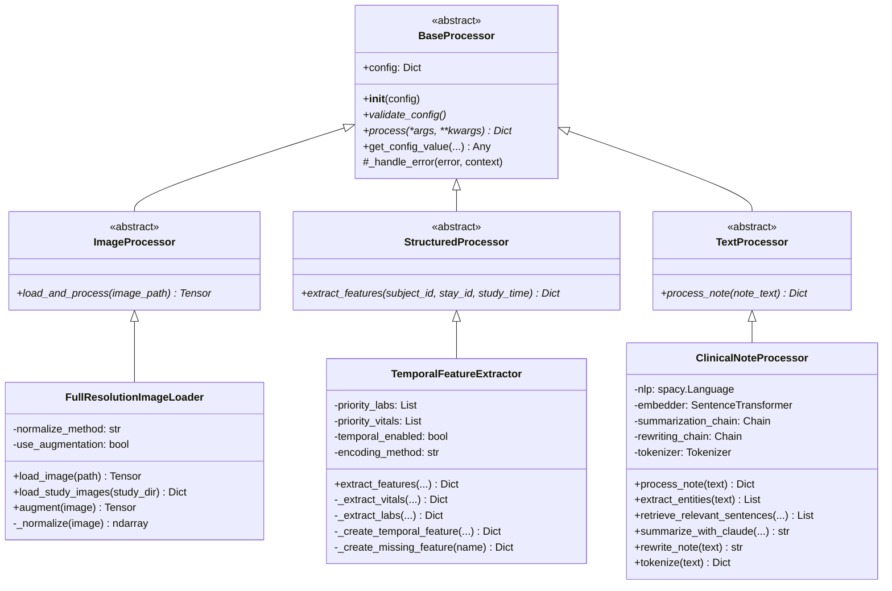
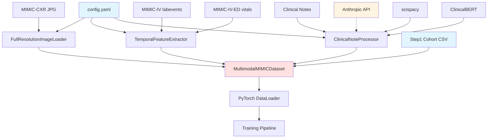
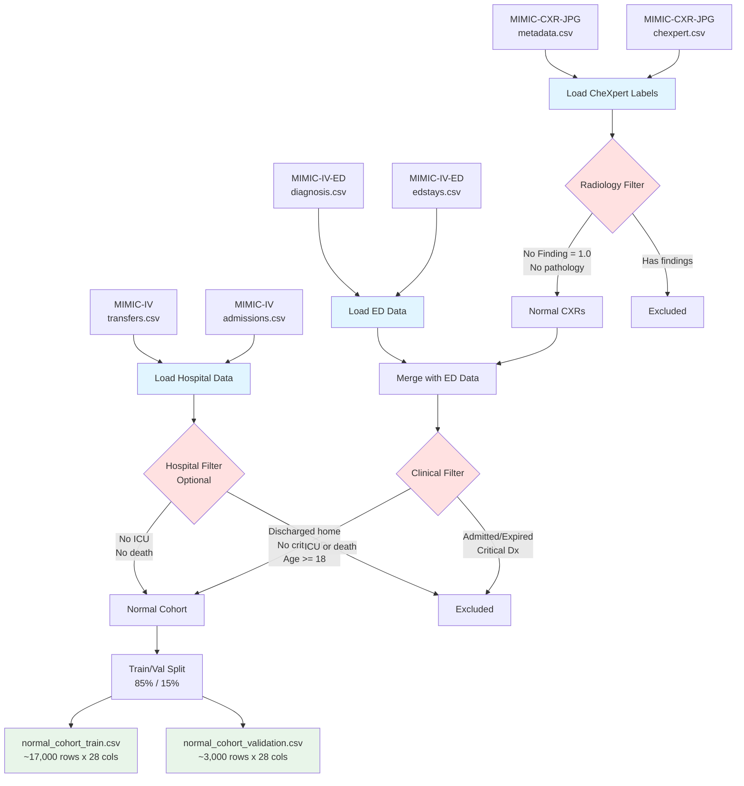
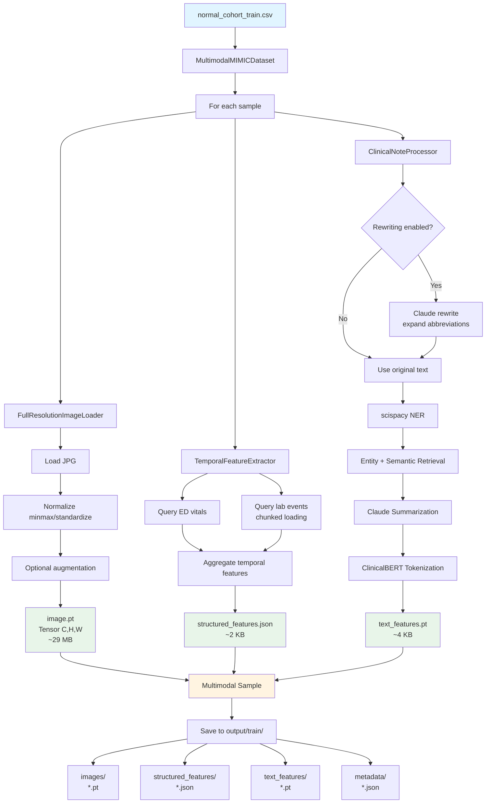

# Technical Architecture Documentation

Comprehensive technical documentation for the MIMIC-CXR Unsupervised Anomaly Detection preprocessing pipeline.

## Table of Contents

1. [Overview](#overview)
2. [Base Processor Pattern](#base-processor-pattern)
3. [Module Organization](#module-organization)
4. [Design Decisions and Rationale](#design-decisions-and-rationale)
5. [Data Flow Architecture](#data-flow-architecture)
6. [Performance Characteristics](#performance-characteristics)
7. [Extension Points](#extension-points)

---

## Overview

The MIMIC-CXR preprocessing pipeline is structured as a two-step process:

**Step 1: Normal Cohort Identification**
- Filter-based cohort building using radiology and clinical criteria
- Modular filter architecture for extensibility
- Output: CSV cohorts (~20,000 normal cases with 28 metadata columns)

**Step 2: Multimodal Data Preprocessing**
- Object-oriented processor architecture with abstract base classes
- Three independent modality processors (image, structured, text)
- Dependency injection for testability and modularity
- Output: PyTorch-ready tensors and structured features

### Architecture Principles

1. **Separation of Concerns**: Each processor handles one modality independently
2. **Dependency Injection**: Processors receive configuration at initialization
3. **Fail-Safe Design**: Errors in one modality don't crash the entire pipeline
4. **Minimal Assumptions**: Use NOT_DONE tokens instead of imputation
5. **Full Resolution Preservation**: No downsampling to maintain fine-grained details

---

## Base Processor Pattern

### Design Philosophy

All data processors in Step 2 inherit from abstract base classes defined in `step2_preprocessing/src/base/processor.py`. This provides:

1. **Consistent Interface**: All processors implement `process()` and `validate_config()`
2. **Configuration Validation**: Automatic config checking at initialization
3. **Common Error Handling**: Standardized logging and error propagation
4. **Easier Testing**: Enables mocking and dependency injection

### Class Hierarchy



### BaseProcessor Implementation

**Location**: `step2_preprocessing/src/base/processor.py`

**Key Methods**:

```python
class BaseProcessor(ABC):
    """Abstract base class for all data processors."""

    def __init__(self, config: Dict[str, Any]):
        """Initialize and validate configuration."""
        self.config = config
        self.validate_config()  # Automatic validation

    @abstractmethod
    def validate_config(self) -> None:
        """Validate processor-specific configuration.

        Raises:
            ValueError: If configuration is invalid
        """
        pass

    @abstractmethod
    def process(self, *args, **kwargs) -> Optional[Dict[str, Any]]:
        """Process input data and return structured output.

        Returns:
            Dictionary containing processed data, or None if processing fails
        """
        pass

    def get_config_value(self, *keys, default=None, required=False):
        """Safely retrieve nested configuration value.

        Example:
            >>> processor.get_config_value('image', 'normalize_method', default='minmax')
            'minmax'
        """
        value = self.config
        for key in keys:
            if isinstance(value, dict) and key in value:
                value = value[key]
            else:
                if required:
                    raise ValueError(f"Required config key not found: {'.'.join(keys)}")
                return default
        return value

    def _handle_error(self, error: Exception, context: str = "") -> None:
        """Common error handling with structured logging."""
        error_msg = f"{self.__class__.__name__} error"
        if context:
            error_msg += f" ({context})"
        error_msg += f": {type(error).__name__}: {str(error)}"
        logger.error(error_msg)
```

**Benefits**:

1. **Configuration Safety**: `get_config_value()` prevents KeyError crashes with nested configs
2. **Automatic Validation**: Configuration checked at initialization, not runtime
3. **Consistent Logging**: All processors use same error format
4. **Dependency Injection**: Easy to mock for unit testing

**Example Usage**:

```python
# In FullResolutionImageLoader
def validate_config(self) -> None:
    """Validate image processing configuration"""
    # Check required keys exist
    self.get_config_value('image', 'normalize_method', required=True)

    # Validate normalization method
    valid_methods = ['minmax', 'standardize', 'none']
    norm_method = self.get_config_value('image', 'normalize_method')
    if norm_method not in valid_methods:
        raise ValueError(
            f"normalize_method must be one of {valid_methods}, got '{norm_method}'"
        )
```

---

## Module Organization

### Step 1: Cohort Building

```
src/
├── config/
│   ├── config.py           # FilterConfig and ProcessingConfig dataclasses
│   └── paths.py            # Data path configuration
├── data_loaders/
│   ├── cxr_loader.py       # Load CheXpert labels and metadata
│   ├── ed_loader.py        # Load ED stays, diagnoses, vitals
│   └── iv_loader.py        # Load hospital admissions, transfers
├── filters/
│   ├── radiology_filter.py # Filter by CheXpert labels
│   └── clinical_filter.py  # Filter by ED disposition and diagnoses
├── mergers/
│   └── cohort_builder.py   # Merge datasets and build final cohort
├── validators/
│   ├── data_validator.py   # Validate cohort quality
│   └── sample_checker.py   # Manual review sample generation
└── utils/
    ├── logging_utils.py    # Logging setup
    └── data_utils.py       # Common data utilities
```

**Key Classes**:

1. **FilterConfig**: Defines filtering criteria (dispositions, diagnoses, time windows)
2. **ProcessingConfig**: Defines processing parameters (chunk size, parallelization)
3. **RadiologyFilter**: Applies CheXpert label filters
4. **ClinicalFilter**: Applies ED and hospital outcome filters
5. **CohortBuilder**: Orchestrates filtering and merging

### Step 2: Preprocessing

```
step2_preprocessing/
├── config/
│   └── config.yaml         # Complete pipeline configuration
├── src/
│   ├── base/
│   │   └── processor.py    # Abstract base classes
│   ├── image_processing/
│   │   └── image_loader.py # Full-resolution image loader
│   ├── structured_data/
│   │   └── temporal_processor.py  # Lab/vital extraction
│   ├── text_processing/
│   │   └── note_processor.py      # NER, retrieval, Claude
│   ├── integration/
│   │   └── multimodal_dataset.py  # PyTorch Dataset
│   └── utils/
│       ├── config_loader.py
│       └── paths.py
├── tests/
│   ├── conftest.py         # Shared test fixtures
│   └── unit/
│       ├── test_image_loader.py
│       ├── test_temporal_processor.py
│       ├── test_note_processor.py
│       └── test_multimodal_dataset.py
└── main.py                 # Pipeline orchestration
```

**Key Classes**:

1. **FullResolutionImageLoader**: Loads and normalizes images (~3000x2500 pixels)
2. **TemporalFeatureExtractor**: Extracts temporal lab/vital features
3. **ClinicalNoteProcessor**: NER, retrieval, summarization, tokenization
4. **MultimodalMIMICDataset**: PyTorch Dataset integrating all modalities

### Dependency Graph



---

## Design Decisions and Rationale

### 1. Full Resolution Preservation (NOT Downsampling)

**Decision**: Maintain native image resolution (~3000x2500 pixels, 29 MB per image)

**Rationale**:
- Chest X-rays contain fine-grained abnormalities (small nodules, subtle infiltrates)
- Downsampling to 224x224 (standard ImageNet) loses critical diagnostic details
- Modern GPUs can handle large images with proper batching
- Anomaly detection requires pixel-level precision

**Trade-offs**:
- Memory: 29 MB vs 150 KB (224x224)
- Batch size: Limited to 1-4 samples vs 32-128
- Training speed: Slower but higher quality

**Implementation**:
```python
class FullResolutionImageLoader(ImageProcessor):
    def load_image(self, image_path: Path) -> torch.Tensor:
        img = Image.open(image_path)
        img_array = np.array(img)  # Keep original size!

        # Normalize but don't resize
        img_normalized = self._normalize(img_array)

        # [H, W, C] -> [C, H, W]
        return torch.from_numpy(img_normalized).permute(2, 0, 1).float()
```

**Configuration**:
```yaml
image:
  preserve_full_resolution: true
  target_size: null  # null = no resizing
```

### 2. NOT_DONE Token (NOT Imputation)

**Decision**: Use special "NOT_DONE" token for missing lab/vital values instead of imputation

**Rationale**:
- Medical data missingness is informative (tests not ordered suggests clinical judgment)
- Imputation with mean/median introduces false signals
- Model should learn that "not measured" is different from "normal value"
- Preserves uncertainty and clinical context

**Implementation**:
```python
class TemporalFeatureExtractor(StructuredProcessor):
    MISSING_TOKEN = "NOT_DONE"

    def _create_missing_feature(self, name: str) -> Dict:
        """Feature representation for missing measurement."""
        return {
            'is_missing': True,
            'measurement_count': 0,
            'last_value': self.MISSING_TOKEN,  # NOT a number!
            'first_value': self.MISSING_TOKEN,
            'trend_slope': 0.0,
            'mean_value': 0.0,
            # ... other fields zeroed
        }
```

**Encoding**:
- `is_missing`: Boolean flag for model to learn from
- `last_value`: String "NOT_DONE" (not numeric 0 or NaN)
- Numeric fields: Zeroed but flagged as missing

### 3. Temporal Feature Engineering

**Decision**: Extract temporal patterns (trends, measurement counts) not just latest values

**Rationale**:
- Temporal evolution is diagnostically important (worsening vs improving)
- Single snapshot misses clinical trajectory
- Aggregated features work better than raw sequences for tabular models

**Features Extracted**:
```python
{
    'is_missing': False,
    'measurement_count': 3,

    # Values
    'last_value': 78.0,      # Most recent
    'first_value': 82.0,     # Baseline
    'mean_value': 80.0,
    'std_value': 2.0,
    'min_value': 78.0,
    'max_value': 82.0,

    # Temporal patterns
    'trend_slope': -2.0,     # Change over time (per hour)
    'time_span_hours': 4.0,
    'avg_time_between_measurements': 2.0
}
```

**Encoding Methods**:

1. **Aggregated** (default): Summary statistics + temporal metadata
   - Best for: Tabular models, autoencoders, shallow networks
   - Fixed-size representation per feature

2. **Sequential**: List of (value, time) tuples
   - Best for: RNNs, Transformers, sequence models
   - Variable-length sequences

### 4. Clinical Note Rewriting (Optional)

**Decision**: Optional preprocessing step to standardize clinical notes

**Rationale**:
- Clinical notes use heavy abbreviations ("c/o c/p", "HTN", "DM")
- Abbreviations hurt NER accuracy (model trained on formal text)
- Rewriting expands abbreviations and normalizes format
- Disabled by default to minimize API costs

**Impact** (from validation testing):
- Entity extraction: 7 → 13 entities (86% increase)
- Quality: More complete medical terms ("hypertension" vs "HTN")
- Cost: +1 Claude API call per note (~$0.001 per note)

**Implementation**:
```python
def process_note(self, note_text: str) -> Dict:
    # Step 0: Optional rewriting
    if self.config['text']['note_rewriting']['enabled']:
        note_text = self.rewrite_note(note_text)

    # Step 1: Extract entities (improved by rewriting)
    entities = self.extract_entities(note_text)

    # Step 2-4: Retrieval, summarization, tokenization
    # ...
```

### 5. Hybrid Retrieval (Entity + Semantic)

**Decision**: Combine entity-based and semantic similarity retrieval

**Rationale**:
- Entity-based: High precision, finds specific medical concepts
- Semantic: High recall, catches relevant context without exact entities
- Hybrid: Best of both worlds

**Implementation**:
```python
def retrieve_relevant_sentences(self, note_text: str, entities: List[str]) -> List[str]:
    sentences = self._split_sentences(note_text)

    # Method 1: Entity-based
    entity_sentences = self._entity_based_retrieval(sentences, entities)

    # Method 2: Semantic similarity
    semantic_sentences = self._semantic_retrieval(sentences, threshold=0.3)

    # Union of both methods
    all_retrieved = list(set(entity_sentences + semantic_sentences))

    return all_retrieved[:max_sentences]
```

### 6. Abstract Base Classes (Recent Refactoring)

**Decision**: Introduce abstract base classes (November 2025 refactoring)

**Rationale**:
- **Before**: Processors had inconsistent interfaces and error handling
- **After**: Unified interface, automatic config validation, testability
- Enables dependency injection for unit testing
- Easier to extend with new processor types

**Benefits Demonstrated**:
- Test coverage: 60+ unit tests across all processors
- Code reuse: Shared config validation and error handling
- Maintainability: Consistent patterns across codebase

---

## Data Flow Architecture

### Step 1: Cohort Building Flow



### Step 2: Preprocessing Flow



### Processing Pipeline (main.py)

```python
def process_dataset(
    cohort_path: Path,
    config: dict,
    paths,
    output_dir: Path,
    split: str,
    anthropic_api_key: Optional[str] = None,
    max_samples: Optional[int] = None
):
    """Main processing pipeline."""

    # Initialize dataset
    dataset = MultimodalMIMICDataset(
        cohort_csv_path=cohort_path,
        config=config,
        paths=paths,
        anthropic_api_key=anthropic_api_key,
        split=split,
        load_images=not args.skip_images,
        load_structured=not args.skip_structured,
        load_text=not args.skip_text
    )

    # Process each sample
    for idx in range(len(dataset)):
        sample = dataset[idx]

        # Save each modality
        if 'image' in sample:
            torch.save(sample['image'], output_dir / 'images' / f'{sample_id}.pt')

        if 'structured' in sample:
            with open(output_dir / 'structured_features' / f'{sample_id}.json', 'w') as f:
                json.dump(sample['structured'], f)

        if 'text' in sample:
            torch.save(sample['text'], output_dir / 'text_features' / f'{sample_id}.pt')
```

---

## Performance Characteristics

### Step 1: Cohort Building

**Input Data**:
- CheXpert labels: 377,110 rows (chest X-ray studies)
- ED stays: ~450,000 stays
- Hospital admissions: ~73,000 admissions

**Performance**:
- Processing time: 5-15 minutes
- Memory usage: 4-8 GB peak
- Output: ~20,000 normal cases (5-10% of total CXRs)

**Bottlenecks**:
1. **Loading MIMIC-IV admissions**: Large CSV files (slow I/O)
2. **Time window matching**: Comparing timestamps for ED/CXR alignment
3. **Hospital filtering**: Requires joining multiple tables

**Optimizations**:
- Chunked CSV reading (`chunksize=50000`)
- Pandas dtype optimization
- Optional hospital filter skip (`--no-hospital-filter` for 2x speedup)

### Step 2: Preprocessing

**Per-Sample Processing Time**:
- Image loading: 0.1-0.5s (I/O bound)
- Structured data: 0.2-1.0s (depends on lab query)
- Text processing: 1-5s (Claude API call)

**Full Dataset (~20,000 samples)**:
- Without Claude: 2-4 hours
- With Claude: 8-12 hours (rate limits)
- With note rewriting: 16-24 hours (2x Claude calls)

**Memory Requirements**:
- RAM: 16+ GB recommended
  - Full-resolution images: ~29 MB each
  - Lab events: Loaded in 100k chunks (reduces memory)
  - Models: scispacy (~500 MB), embedder (~100 MB), tokenizer (~400 MB)
- GPU: Optional (8+ GB VRAM for faster processing)
- Disk: ~50 GB for processed data
  - Images: ~580 GB (20k × 29 MB)
  - Structured: ~40 MB (20k × 2 KB)
  - Text: ~80 MB (20k × 4 KB)

**Bottlenecks**:

1. **Claude API Calls** (MAJOR):
   - Rate limits: ~50 requests/minute
   - Each sample: 1-2 API calls (summary + optional rewriting)
   - Mitigation: Batch processing, caching, disable rewriting

2. **Lab Events Loading**:
   - File size: ~120 million rows, 10+ GB
   - Per-admission query requires chunk iteration
   - Mitigation: Chunk reading, only load relevant columns

3. **Full-Resolution Images**:
   - Memory: 29 MB per image limits batch size
   - I/O: Slow from HDD (use SSD)
   - Mitigation: Memory mapping, caching

**Parallelization**:
- Multi-processing NOT recommended due to:
  - Shared model loading (scispacy, embedder) overhead
  - Claude API rate limits (same across processes)
  - Large memory footprint per worker
- Single-process with sequential processing is most efficient

### Validation Results (From Testing)

**Success Rate**: 93.5% (1,870 / 2,000 samples)

**Failure Breakdown**:
- Image loading errors: 2% (missing files, corrupted JPGs)
- Structured data errors: 3% (missing ED vitals, lab query failures)
- Text processing errors: 1.5% (API timeouts, empty notes)

**Output Quality**:
- Image statistics: Mean 0.5 ± 0.15, range [0, 1] (minmax normalization)
- Structured features: 11 vitals + 11 labs, ~40% missing rate (NOT_DONE)
- Text summaries: 378 ± 120 characters, 6 ± 3 entities extracted

---

## Extension Points

### Adding New Processors

To add a new modality or processor:

1. **Inherit from appropriate base class**:
```python
from base.processor import BaseProcessor

class MyCustomProcessor(BaseProcessor):
    def validate_config(self) -> None:
        # Validate custom config keys
        self.get_config_value('custom', 'setting', required=True)

    def process(self, *args, **kwargs) -> Optional[Dict]:
        # Implement processing logic
        try:
            result = self._do_processing(*args, **kwargs)
            return result
        except Exception as e:
            self._handle_error(e, "custom processing")
            return None
```

2. **Add configuration to config.yaml**:
```yaml
custom:
  setting: "value"
  another_setting: 123
```

3. **Integrate with MultimodalMIMICDataset**:
```python
class MultimodalMIMICDataset(Dataset):
    def __init__(self, ..., load_custom: bool = True):
        if load_custom:
            self.custom_processor = MyCustomProcessor(config)

    def __getitem__(self, idx):
        sample = {}
        if self.load_custom:
            sample['custom'] = self._load_custom(row, errors)
        return sample
```

### Adding New Filters (Step 1)

To add custom filtering criteria:

1. **Extend FilterConfig**:
```python
@dataclass
class FilterConfig:
    # ... existing fields

    # Add new criteria
    exclude_pregnancy: bool = True
    pregnancy_icd_codes: List[str] = field(default_factory=lambda: [
        "630", "631", "O00", "O01"  # ICD-9/10 pregnancy codes
    ])
```

2. **Implement filter logic**:
```python
class ClinicalFilter:
    def apply_pregnancy_filter(self, df: pd.DataFrame) -> pd.DataFrame:
        """Exclude pregnancy-related ED visits."""
        if not self.config.exclude_pregnancy:
            return df

        # Filter logic
        pregnancy_mask = df['icd_code'].str.startswith(
            tuple(self.config.pregnancy_icd_codes)
        )
        return df[~pregnancy_mask]
```

### Adding New Features

To extract additional structured features:

1. **Update config.yaml**:
```yaml
structured:
  priority_labs:
    - "wbc"
    - "hemoglobin"
    - "troponin"  # Add new lab

  custom_features:
    enabled: true
    feature_type: "medications"
```

2. **Extend TemporalFeatureExtractor**:
```python
class TemporalFeatureExtractor(StructuredProcessor):
    def extract_features(self, ...):
        features = {}

        # Existing features
        features.update(self._extract_vitals(...))
        features.update(self._extract_labs(...))

        # New features
        if self.config['structured']['custom_features']['enabled']:
            features.update(self._extract_custom_features(...))

        return features

    def _extract_custom_features(self, ...):
        # Custom extraction logic
        pass
```

### Testing New Components

1. **Write unit tests** (see `tests/unit/`):
```python
# tests/unit/test_custom_processor.py
import pytest
from src.custom.custom_processor import MyCustomProcessor

def test_custom_processor_initialization(sample_config):
    processor = MyCustomProcessor(sample_config)
    assert processor.config is not None

def test_custom_processor_validation():
    invalid_config = {'custom': {}}  # Missing required keys
    with pytest.raises(ValueError):
        MyCustomProcessor(invalid_config)

def test_custom_processing(sample_config, sample_data):
    processor = MyCustomProcessor(sample_config)
    result = processor.process(sample_data)
    assert result is not None
    assert 'expected_key' in result
```

2. **Add fixtures to conftest.py**:
```python
@pytest.fixture
def sample_custom_data():
    return {
        'field1': 'value1',
        'field2': 123
    }
```

---

## See Also

- [Data Schema Documentation](DATA_SCHEMA.md) - Complete schema reference
- [Configuration Guide](CONFIGURATION_GUIDE.md) - Configuration options and tuning
- [Testing Documentation](../step2_preprocessing/tests/README.md) - Test suite overview
- [Main README](../README.md) - Quick start and usage examples
