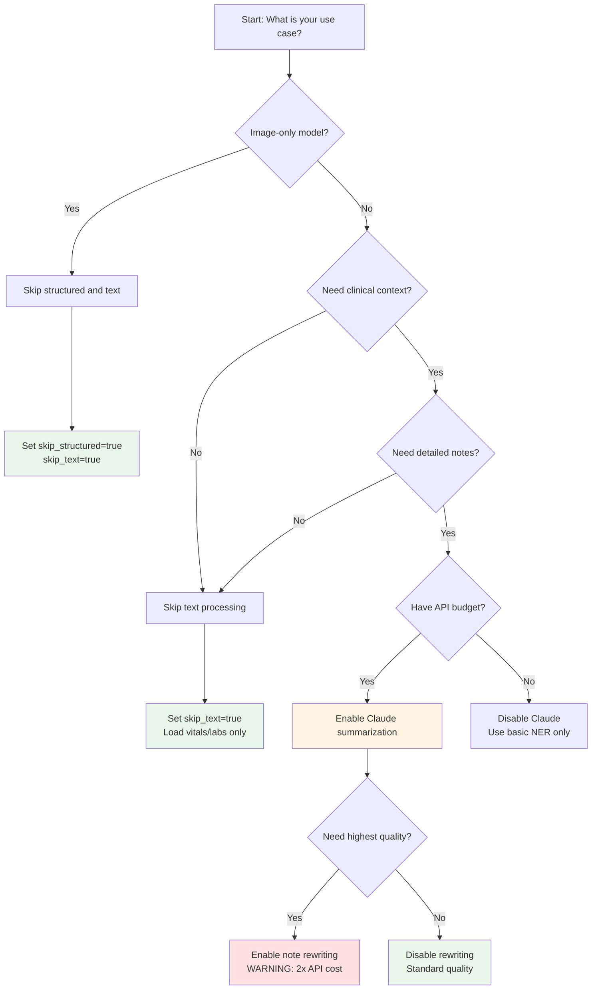
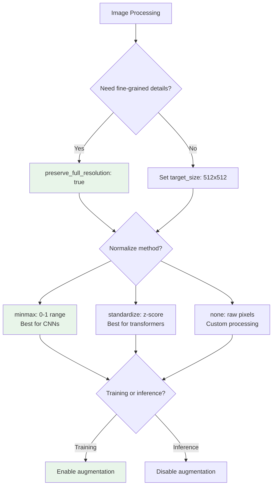
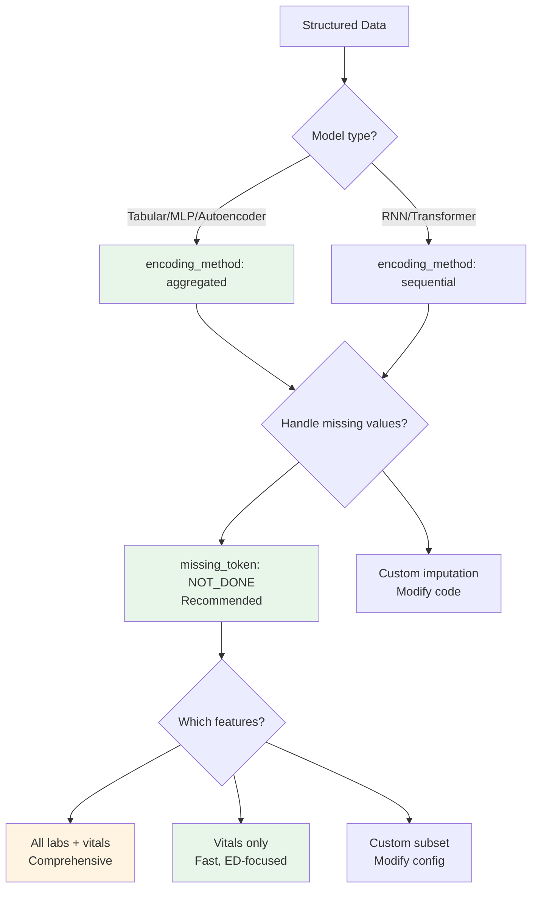
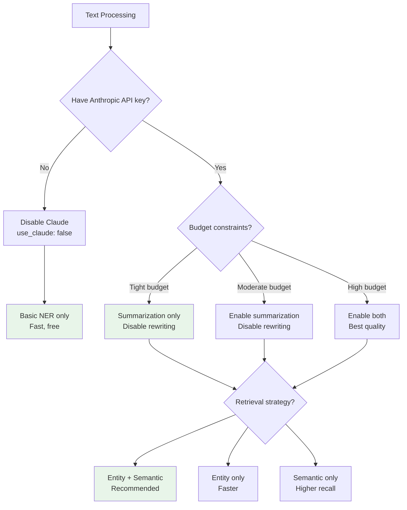
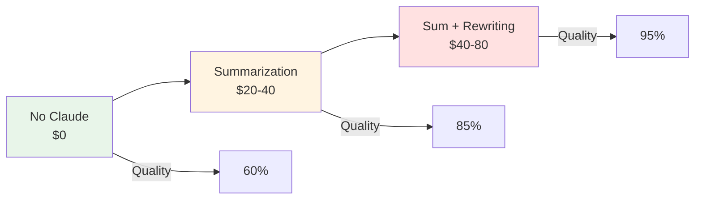

# Configuration Guide

Comprehensive guide for configuring the MIMIC-CXR preprocessing pipeline, including decision trees, tradeoffs, and recommended presets.

## Table of Contents

1. [Overview](#overview)
2. [Configuration Structure](#configuration-structure)
3. [Decision Trees](#decision-trees)
4. [Configuration Sections](#configuration-sections)
5. [Tradeoffs Analysis](#tradeoffs-analysis)
6. [Recommended Presets](#recommended-presets)
7. [Performance Tuning](#performance-tuning)
8. [Common Scenarios](#common-scenarios)

---

## Overview

The pipeline uses two configuration systems:

**Step 1**: Python dataclasses in `src/config/config.py`
- FilterConfig: Filtering criteria
- ProcessingConfig: Processing parameters

**Step 2**: YAML configuration in `step2_preprocessing/config/config.yaml`
- Image processing settings
- Structured data settings
- Text processing settings
- Processing and resource settings

---

## Configuration Structure

### Step 2 Config Overview

```yaml
step2_preprocessing/config/config.yaml
├── data                    # Data paths
├── image                   # Image processing
│   ├── preserve_full_resolution
│   ├── normalize_method
│   └── augmentation
├── structured             # Structured data
│   ├── missing_token
│   ├── temporal_features
│   ├── priority_labs
│   └── priority_vitals
├── text                   # Text processing
│   ├── ner
│   ├── retrieval
│   ├── summarization
│   ├── note_rewriting
│   └── tokenizer
└── processing             # Resource settings
    ├── batch_size
    ├── num_workers
    └── use_gpu
```

---

## Decision Trees

### Primary Decision: What Data Do You Need?



### Image Processing Decision



### Structured Data Decision



### Text Processing Decision



---

## Configuration Sections

### Data Paths Section

```yaml
data:
  # Step 1 outputs
  step1_cohort_train: "../output/cohorts/normal_cohort_train.csv"
  step1_cohort_val: "../output/cohorts/normal_cohort_validation.csv"

  # MIMIC data locations (UPDATE THESE)
  mimic_cxr_base: "/path/to/mimic-cxr-jpg"
  mimic_iv_base: "/path/to/mimiciv/3.1"
  mimic_ed_base: "/path/to/mimic-iv-ed/2.2"

  # Output location
  output_base: "./output"
```

**Key Decisions**:
- Ensure paths point to correct MIMIC data directories
- Use absolute paths or relative to `step2_preprocessing/`
- Output directory requires ~50 GB for full dataset

### Image Processing Section

```yaml
image:
  # Resolution settings
  preserve_full_resolution: true  # NO downsampling
  target_size: null              # null = keep original

  # Normalization
  normalize_method: "minmax"     # Options: "minmax", "standardize", "none"

  # Augmentation (training only)
  augmentation:
    enabled: true
    rotation_range: 5           # ±5 degrees
    horizontal_flip: false      # Never flip CXRs!
    vertical_flip: false
    brightness_range: 0.1       # ±10%
    contrast_range: 0.1         # ±10%

  # Memory management
  use_memory_mapping: true
  cache_processed: false        # Set true if you have storage
```

**Options Explained**:

| Option | Values | Description | When to Use |
|--------|--------|-------------|-------------|
| `preserve_full_resolution` | true/false | Keep native ~3000x2500 resolution | true: anomaly detection, fine details<br/>false: classification, speed |
| `normalize_method` | minmax | Scale to [0, 1] | CNNs, standard preprocessing |
| | standardize | Zero mean, unit variance | Transformers, batch norm |
| | none | No normalization | Custom preprocessing |
| `rotation_range` | 0-10 | Rotation augmentation (degrees) | 5: mild augmentation<br/>0: no rotation |
| `brightness_range` | 0.0-0.3 | Brightness variation | 0.1: standard<br/>0.2: aggressive |
| `cache_processed` | true/false | Save processed images to disk | true: repeated access<br/>false: one-time processing |

**Common Configurations**:

```yaml
# High quality (default)
preserve_full_resolution: true
normalize_method: "minmax"
augmentation.enabled: true

# Fast mode (downsampled)
preserve_full_resolution: false
target_size: 512  # 512x512
normalize_method: "minmax"
augmentation.enabled: false

# Inference mode
preserve_full_resolution: true
normalize_method: "minmax"
augmentation.enabled: false  # NO augmentation for inference!
```

### Structured Data Section

```yaml
structured:
  # Missing value handling
  missing_token: "NOT_DONE"
  use_missing_flags: true

  # Temporal features
  temporal_features:
    enabled: true
    include_time_since_admission: true
    include_measurement_count: true
    include_ordinal_index: true
    include_time_between_measurements: true

  # Encoding method
  encoding_method: "aggregated"  # Options: "aggregated", "sequential"

  # Priority labs (11 labs)
  priority_labs:
    - "wbc"
    - "hemoglobin"
    - "hematocrit"
    - "platelets"
    - "sodium"
    - "potassium"
    - "chloride"
    - "bicarbonate"
    - "bun"
    - "creatinine"
    - "glucose"

  # Priority vitals (6 vitals)
  priority_vitals:
    - "temperature"
    - "heartrate"
    - "resprate"
    - "o2sat"
    - "sbp"
    - "dbp"
```

**Options Explained**:

| Option | Values | Description | When to Use |
|--------|--------|-------------|-------------|
| `missing_token` | "NOT_DONE" | Token for missing values | Recommended: preserves missingness info |
| `use_missing_flags` | true/false | Add is_missing boolean | true: helps model learn from missingness |
| `temporal_features.enabled` | true/false | Extract temporal patterns | true: capture trends over time<br/>false: single snapshot |
| `encoding_method` | aggregated | Summary statistics | Tabular models, autoencoders |
| | sequential | Time-series sequences | RNNs, Transformers |

**Custom Lab/Vital Selection**:

```yaml
# Minimal vitals only (fast)
priority_vitals:
  - "heartrate"
  - "o2sat"
  - "resprate"

priority_labs: []  # No labs

# Custom cardiac focus
priority_labs:
  - "troponin"
  - "bnp"
  - "creatinine"
  - "potassium"

priority_vitals:
  - "heartrate"
  - "sbp"
  - "dbp"
```

### Text Processing Section

```yaml
text:
  # Named Entity Recognition
  ner:
    model: "en_core_sci_md"    # scispacy model
    extract_entities: true

  # Retrieval settings
  retrieval:
    use_entity_based: true     # Retrieve sentences with entities
    use_semantic_fallback: true # Semantic similarity fallback
    max_sentences: 20          # Max sentences for summarization
    similarity_threshold: 0.3  # Semantic similarity threshold

  # Claude summarization
  summarization:
    use_claude: true
    model: "claude-sonnet-4-5-20250929"
    max_summary_length: 500    # tokens
    temperature: 0.0           # Deterministic
    system_prompt: "You are a medical expert summarizing clinical notes..."

  # Note rewriting (optional, expensive)
  note_rewriting:
    enabled: false             # DISABLED by default
    use_claude: true
    model: "claude-sonnet-4-5-20250929"
    max_rewrite_length: 2000
    temperature: 0.0

  # Tokenization
  tokenizer:
    model: "emilyalsentzer/Bio_ClinicalBERT"
    max_length: 512
    padding: "max_length"
    truncation: true
```

**Options Explained**:

| Option | Values | Description | Cost Impact |
|--------|--------|-------------|-------------|
| `use_claude` | true/false | Enable Claude API | true: $$ (API costs)<br/>false: Free |
| `note_rewriting.enabled` | true/false | Rewrite notes before processing | true: 2x API cost<br/>false: Standard cost |
| `max_sentences` | 5-30 | Sentences for context | 20: balanced<br/>30: more context, higher cost |
| `similarity_threshold` | 0.2-0.5 | Semantic retrieval cutoff | 0.3: balanced<br/>0.2: more sentences |
| `temperature` | 0.0-1.0 | LLM randomness | 0.0: deterministic<br/>0.3: varied |

**Cost Optimization**:

```yaml
# Minimal cost
summarization:
  use_claude: false          # Disable Claude
note_rewriting:
  enabled: false

# Moderate cost (recommended)
summarization:
  use_claude: true
  max_summary_length: 300    # Shorter summaries
note_rewriting:
  enabled: false             # Skip rewriting

# High quality (expensive)
summarization:
  use_claude: true
  max_summary_length: 500
note_rewriting:
  enabled: true              # Enable rewriting
```

**API Cost Estimation** (20,000 samples):

| Configuration | API Calls | Estimated Cost |
|---------------|-----------|----------------|
| No Claude | 0 | $0 |
| Summarization only | 20,000 | $20-40 |
| Summarization + Rewriting | 40,000 | $40-80 |

### Processing Section

```yaml
processing:
  batch_size: 1              # For full resolution images
  num_workers: 4
  use_gpu: true
  device: "cuda"             # or "cpu"

  # Logging
  verbose: true
  log_every_n: 10

# Debugging
debug:
  enabled: false
  max_samples: 10            # Process only N samples
  save_intermediate: true
```

**Options Explained**:

| Option | Values | Description | When to Use |
|--------|--------|-------------|-------------|
| `batch_size` | 1-8 | Samples per batch | 1: full res images<br/>4: downsampled<br/>8: small models |
| `num_workers` | 0-8 | Parallel data loading | 4: balanced<br/>0: debug mode |
| `use_gpu` | true/false | Use GPU for processing | true: if available<br/>false: CPU only |
| `log_every_n` | 1-100 | Log frequency | 10: standard<br/>1: debug<br/>100: quiet |

**Resource Configurations**:

```yaml
# High-end workstation (32GB RAM, RTX 3090)
batch_size: 4
num_workers: 8
use_gpu: true

# Standard laptop (16GB RAM, no GPU)
batch_size: 1
num_workers: 2
use_gpu: false

# Debug mode
batch_size: 1
num_workers: 0  # No parallel loading
debug.enabled: true
debug.max_samples: 5
```

---

## Tradeoffs Analysis

### Speed vs Quality

| Setting | Speed | Quality | Memory | Cost |
|---------|-------|---------|--------|------|
| **Full resolution** | Slow | High | High | - |
| Downsampled (512×512) | Fast | Medium | Low | - |
| **Claude summarization** | Slow | High | - | $$ |
| No Claude (NER only) | Fast | Medium | - | Free |
| **Note rewriting** | Very Slow | Highest | - | $$$ |
| No rewriting | Moderate | High | - | $$ |
| **All modalities** | Slow | Complete | High | $$$ |
| Image only | Fast | Limited | Medium | $ |

### Cost vs Completeness



**Cost Breakdown** (20,000 samples):

| Component | API Calls | Cost Estimate |
|-----------|-----------|---------------|
| Image processing | 0 | $0 (local) |
| Structured data | 0 | $0 (local) |
| NER (scispacy) | 0 | $0 (local) |
| **Claude summarization** | 20,000 | $20-40 |
| **Note rewriting** | +20,000 | +$20-40 |
| **Total (full pipeline)** | 40,000 | $40-80 |

**Cost per Sample**:
- Without Claude: ~$0.00
- Summarization only: ~$0.001-0.002
- Full pipeline (rewriting): ~$0.002-0.004

### Memory vs Performance

| Configuration | RAM Usage | Processing Time | Disk Space |
|---------------|-----------|-----------------|------------|
| Full res + all modalities | 16+ GB | 12-24 hours | 650 GB |
| Full res + no text | 8 GB | 2-4 hours | 600 GB |
| Downsampled + all | 8 GB | 6-12 hours | 100 GB |
| Image only | 4 GB | 1-2 hours | 50 GB |

### Accuracy vs Efficiency

**Image Resolution Impact**:
- Full resolution (3000×2500): 100% detail preservation
- 1024×1024: ~95% detail, 3x faster
- 512×512: ~85% detail, 10x faster
- 224×224: ~60% detail, 30x faster (NOT recommended)

**Text Processing Impact**:
| Method | Entity Extraction | Summary Quality | Speed |
|--------|------------------|----------------|-------|
| No processing | 0% | N/A | Instant |
| NER only | 100% | N/A | Fast |
| NER + Retrieval | 100% | Medium | Fast |
| NER + Claude | 100% | High | Slow |
| Rewriting + Claude | 186% | Highest | Very Slow |

---

## Recommended Presets

### 1. Fast Mode (Development/Testing)

**Use case**: Quick testing, development, prototyping

```yaml
# config_fast.yaml
image:
  preserve_full_resolution: false
  target_size: 512
  normalize_method: "minmax"
  augmentation:
    enabled: false

structured:
  encoding_method: "aggregated"
  priority_labs: []  # No labs (ED vitals only)
  priority_vitals:
    - "heartrate"
    - "o2sat"

text:
  summarization:
    use_claude: false
  note_rewriting:
    enabled: false

processing:
  batch_size: 4
  num_workers: 4

debug:
  enabled: true
  max_samples: 100
```

**Performance**:
- Speed: ~10 samples/sec
- Time (100 samples): ~10 seconds
- Time (20k samples): ~30 minutes
- RAM: 4-8 GB
- Cost: $0

**Command**:
```bash
python main.py --max-samples 100 --skip-text
```

### 2. Quality Mode (Production)

**Use case**: Final training data, publication, production models

```yaml
# config_quality.yaml
image:
  preserve_full_resolution: true
  normalize_method: "minmax"
  augmentation:
    enabled: true
    rotation_range: 5
    brightness_range: 0.1
    contrast_range: 0.1

structured:
  encoding_method: "aggregated"
  priority_labs:  # All 11 labs
    - "wbc"
    - "hemoglobin"
    # ... (full list)
  priority_vitals:  # All 6 vitals
    - "temperature"
    - "heartrate"
    # ... (full list)
  temporal_features:
    enabled: true

text:
  summarization:
    use_claude: true
    model: "claude-sonnet-4-5-20250929"
    max_summary_length: 500
  note_rewriting:
    enabled: true  # ENABLED for highest quality
  retrieval:
    use_entity_based: true
    use_semantic_fallback: true

processing:
  batch_size: 1
  num_workers: 4
  use_gpu: true
```

**Performance**:
- Speed: ~0.2-0.5 samples/sec
- Time (20k samples): 16-24 hours
- RAM: 16+ GB
- Cost: $40-80

**Command**:
```bash
export ANTHROPIC_API_KEY='your-key'
python main.py
```

### 3. Balanced Mode (Recommended)

**Use case**: Most use cases, good quality-speed tradeoff

```yaml
# config_balanced.yaml (default config.yaml)
image:
  preserve_full_resolution: true
  normalize_method: "minmax"
  augmentation:
    enabled: true

structured:
  encoding_method: "aggregated"
  priority_labs:  # All 11 labs
  priority_vitals:  # All 6 vitals
  temporal_features:
    enabled: true

text:
  summarization:
    use_claude: true
    max_summary_length: 500
  note_rewriting:
    enabled: false  # DISABLED to save cost
  retrieval:
    use_entity_based: true
    use_semantic_fallback: true

processing:
  batch_size: 1
  num_workers: 4
  use_gpu: true
```

**Performance**:
- Speed: ~0.5-1 samples/sec
- Time (20k samples): 8-12 hours
- RAM: 16 GB
- Cost: $20-40

**Command**:
```bash
export ANTHROPIC_API_KEY='your-key'
python main.py
```

### 4. Debug Mode

**Use case**: Debugging, error investigation, single samples

```yaml
# config_debug.yaml
# Same as balanced, but:

processing:
  batch_size: 1
  num_workers: 0  # No parallel loading
  verbose: true
  log_every_n: 1  # Log every sample

debug:
  enabled: true
  max_samples: 5
  save_intermediate: true
```

**Command**:
```bash
python main.py --max-samples 5 --log-level DEBUG
```

### 5. Inference Mode

**Use case**: Processing new data for trained model

```yaml
# config_inference.yaml
image:
  preserve_full_resolution: true
  normalize_method: "minmax"  # MUST match training
  augmentation:
    enabled: false  # NO augmentation for inference!

structured:
  encoding_method: "aggregated"  # MUST match training
  # Same labs/vitals as training

text:
  summarization:
    use_claude: true
  note_rewriting:
    enabled: false  # Match training config

processing:
  batch_size: 1
  num_workers: 4
```

**Important**: Match normalization and encoding to training config!

---

## Performance Tuning

### Bottleneck Identification

**Profile your pipeline**:
```bash
python main.py --max-samples 100 --profile
```

Common bottlenecks:
1. **Claude API calls**: 1-5s per call, rate limited
2. **Lab events loading**: Large file (~10 GB), chunk iteration
3. **Full-resolution images**: I/O bound, 29 MB per image

### Optimization Strategies

#### 1. Parallelize Data Loading

```yaml
processing:
  num_workers: 8  # Use more workers for I/O bound tasks
  batch_size: 2   # Increase batch size if possible
```

**Trade-off**: More memory usage

#### 2. Use SSD for Data

- Store MIMIC data on SSD (not HDD)
- Store output on SSD during processing
- **Impact**: 2-3x faster image loading

#### 3. Cache Processed Data

```yaml
image:
  cache_processed: true
```

**Use when**:
- Multiple training runs on same data
- Sufficient disk space (~650 GB)

#### 4. Optimize Claude API Usage

**Batch requests** (not currently implemented):
```python
# Future optimization: batch summarization
summaries = claude_batch([note1, note2, ...])
```

**Disable rewriting**:
```yaml
text:
  note_rewriting:
    enabled: false  # Save 50% API time and cost
```

#### 5. Skip Unnecessary Modalities

```bash
# Image-only training
python main.py --skip-structured --skip-text

# Structured + Image (no text)
python main.py --skip-text
```

### GPU Acceleration

**Current GPU usage**:
- Image loading: Minimal (CPU-based with PIL)
- Text models: CPU-based (scispacy, embedder)
- Claude: API-based (no local GPU)

**Potential optimizations**:
```python
# Move image processing to GPU
image = torch.from_numpy(img).to('cuda')
normalized = (image - mean) / std  # GPU ops
```

**Future work**:
- GPU-based image augmentation
- Batched embedding on GPU
- Local LLM inference (vs Claude API)

### Memory Optimization

**Reduce memory footprint**:

1. **Chunk processing**:
```python
# Process in chunks of 1000 samples
for chunk_start in range(0, len(dataset), 1000):
    chunk_end = min(chunk_start + 1000, len(dataset))
    process_chunk(dataset[chunk_start:chunk_end])
```

2. **Lazy loading**:
```yaml
image:
  use_memory_mapping: true  # Don't load all images at once
```

3. **Reduce batch size**:
```yaml
processing:
  batch_size: 1  # Process one at a time
```

### Monitoring and Logging

**Enable detailed logging**:
```yaml
processing:
  verbose: true
  log_every_n: 10
```

**Monitor resources**:
```bash
# In separate terminal
watch -n 1 nvidia-smi  # GPU usage
htop                   # CPU/RAM usage
```

**Check progress**:
```bash
# Count processed files
ls output/train/images/*.pt | wc -l

# Tail log
tail -f output/preprocessing.log
```

---

## Common Scenarios

### Scenario 1: Limited API Budget

**Goal**: Minimize Claude API costs

**Configuration**:
```yaml
text:
  summarization:
    use_claude: false  # Disable entirely
  note_rewriting:
    enabled: false

# OR use summarization but skip rewriting
text:
  summarization:
    use_claude: true
    max_summary_length: 200  # Shorter summaries
  note_rewriting:
    enabled: false
```

**Alternative**: Process subset with Claude
```bash
# Process 1000 samples with Claude for validation
python main.py --max-samples 1000

# Process rest without Claude
python main.py --skip-text --output-dir output_no_text
```

### Scenario 2: Limited Storage

**Goal**: Minimize disk usage

**Configuration**:
```yaml
image:
  preserve_full_resolution: false
  target_size: 512  # 512×512 instead of 3000×2500

# Skip one modality
# Use --skip-structured or --skip-text
```

**Impact**:
- Full resolution: ~650 GB
- 512×512: ~50 GB (13x reduction)

**Command**:
```bash
# Downsample images, skip text
python main.py --skip-text
```

### Scenario 3: Fast Iteration (Development)

**Goal**: Quick experimentation, fast feedback

**Configuration**:
```yaml
debug:
  enabled: true
  max_samples: 50

processing:
  num_workers: 0  # Easier to debug
  log_every_n: 1

image:
  preserve_full_resolution: false
  target_size: 256  # Very small for speed
  augmentation:
    enabled: false
```

**Command**:
```bash
python main.py --max-samples 50 --skip-text --log-level DEBUG
```

### Scenario 4: Production Deployment

**Goal**: High-quality data for final model

**Configuration**: Use **Quality Mode** preset (see above)

**Additional considerations**:
1. **Reproducibility**:
```yaml
processing:
  random_seed: 42  # Set seed for augmentation
```

2. **Validation**:
```bash
# Process validation set separately
python main.py --val-only --output-dir output_val
```

3. **Quality checks**:
```python
# Validate outputs
from validate_mae_readiness import validate_preprocessing

validate_preprocessing('output/train')
```

### Scenario 5: Multi-GPU System

**Current limitation**: Pipeline is single-GPU

**Workaround**: Split cohort and run multiple instances

```bash
# Terminal 1 (GPU 0): First half
CUDA_VISIBLE_DEVICES=0 python main.py \
  --cohort-subset 0-10000 \
  --output-dir output_gpu0

# Terminal 2 (GPU 1): Second half
CUDA_VISIBLE_DEVICES=1 python main.py \
  --cohort-subset 10000-20000 \
  --output-dir output_gpu1

# Merge outputs
python merge_outputs.py output_gpu0 output_gpu1 output_merged
```

### Scenario 6: Only Need Images

**Goal**: Image-only model (e.g., CNN autoencoder)

**Configuration**:
```bash
# Simplest: command-line flags
python main.py --skip-structured --skip-text
```

**OR modify config**:
```yaml
# Not necessary with CLI flags, but can set:
structured:
  priority_labs: []
  priority_vitals: []
```

### Scenario 7: Missing Clinical Notes

**Scenario**: Some samples have no clinical notes

**Behavior**: Automatic handling
- Empty notes return empty text features
- `num_entities: 0`, `summary: ""`
- No API call made (saves cost)

**Configuration**: No change needed (automatic)

---

## Configuration Validation

### Validate Before Running

```bash
# Dry run: validate config without processing
python main.py --validate-config

# Test on small subset
python main.py --max-samples 5 --log-level DEBUG
```

### Common Configuration Errors

**Error**: `ValueError: Required config key not found: image.normalize_method`
- **Fix**: Add missing key to config.yaml

**Error**: `FileNotFoundError: No such file or directory: '/path/to/mimic-cxr-jpg'`
- **Fix**: Update `data.mimic_cxr_base` path in config.yaml

**Error**: `RuntimeError: CUDA out of memory`
- **Fix**: Reduce `batch_size` or set `use_gpu: false`

**Error**: `AnthropicAPIError: 401 Unauthorized`
- **Fix**: Set `ANTHROPIC_API_KEY` environment variable

**Error**: `ModuleNotFoundError: No module named 'spacy'`
- **Fix**: Install dependencies: `pip install -r requirements.txt`

### Configuration Checklist

Before running full pipeline:

- [ ] Update all paths in `data` section
- [ ] Set `preserve_full_resolution` appropriately
- [ ] Choose `encoding_method` (aggregated vs sequential)
- [ ] Decide on Claude usage (`use_claude` and `note_rewriting.enabled`)
- [ ] Set `ANTHROPIC_API_KEY` if using Claude
- [ ] Configure resources (`batch_size`, `num_workers`, `use_gpu`)
- [ ] Test with `--max-samples 5` first
- [ ] Check available disk space (~650 GB for full dataset)
- [ ] Verify RAM (16+ GB recommended)

---

## See Also

- [Architecture Documentation](ARCHITECTURE.md) - Technical architecture and design
- [Data Schema Documentation](DATA_SCHEMA.md) - Output schema and formats
- [Main README](../README.md) - Quick start and usage examples
- [Step 2 README](../step2_preprocessing/README.md) - Detailed Step 2 documentation
