# MAE Reconstruction Analysis by Pathology

This document presents a visual comparison of original chest X-ray images versus their MAE (Masked Autoencoder) reconstructions for each of the 13 pathology classes in the MIMIC-CXR dataset.

## Overview

The MAE model was trained on **normal** chest X-rays to learn typical anatomical patterns. When applied to **anomalous** images (those with pathologies), the model struggles to accurately reconstruct abnormal regions, resulting in higher reconstruction error. This reconstruction error serves as an anomaly signal.

**Methodology:**
- Images are center-cropped to 1024x1024 pixels
- 75% of image patches are masked during reconstruction
- Mean Squared Error (MSE) measures reconstruction quality
- Higher MSE indicates the model found the image harder to reconstruct

## Reconstruction Error Summary

| Rank | Pathology | MSE | Interpretation |
|------|-----------|-----|----------------|
| 1 | Pleural Other | 0.000907 | Highest error - most anomalous |
| 2 | Pneumothorax | 0.000873 | |
| 3 | Pneumonia | 0.000867 | |
| 4 | Fracture | 0.000864 | |
| 5 | Lung Lesion | 0.000816 | |
| 6 | Edema | 0.000814 | |
| 7 | Atelectasis | 0.000622 | |
| 8 | Pleural Effusion | 0.000618 | |
| 9 | Lung Opacity | 0.000544 | |
| 10 | Cardiomegaly | 0.000511 | |
| 11 | Enlarged Cardiomediastinum | 0.000509 | |
| 12 | Support Devices | 0.000418 | |
| 13 | Consolidation | 0.000356 | Lowest error - closest to normal |

## Key Observations

1. **High reconstruction error pathologies** (Pleural Other, Pneumothorax, Pneumonia, Fracture): These conditions introduce visual patterns that deviate significantly from normal anatomy, making them harder for the MAE to reconstruct.

2. **Moderate reconstruction error** (Lung Lesion, Edema, Atelectasis, Pleural Effusion): These show intermediate difficulty, often involving opacity changes or fluid accumulation.

3. **Lower reconstruction error** (Cardiomegaly, Support Devices, Consolidation): These may have more predictable patterns or overlap with variations the model learned from normal images.

## Visual Comparisons by Pathology

Each comparison shows:
- **Original**: The input chest X-ray (1024x1024 center crop)
- **MAE Reconstruction**: What the model reconstructs after masking 75% of patches
- **Squared Error**: Per-pixel MSE heatmap (brighter = higher error)
- **Anomaly Overlay**: Error heatmap blended with original (warmer colors = potential anomaly regions)

---

### 1. Atelectasis
Partial or complete collapse of the lung or a lobe of the lung.

---

### 2. Cardiomegaly
Enlarged heart, often visible as widened cardiac silhouette.

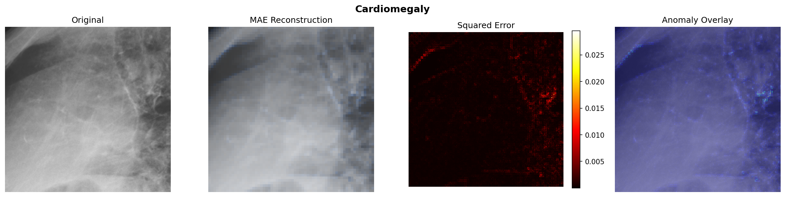

---

### 3. Consolidation
Lung tissue filled with fluid instead of air, appearing as opaque regions.

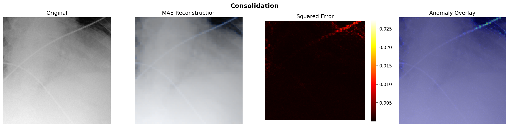

---

### 4. Edema
Fluid accumulation in the lungs, causing hazy opacities.

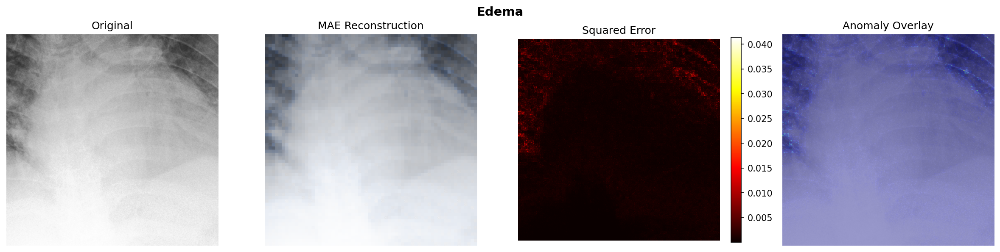

---

### 5. Enlarged Cardiomediastinum
Widening of the mediastinal structures.

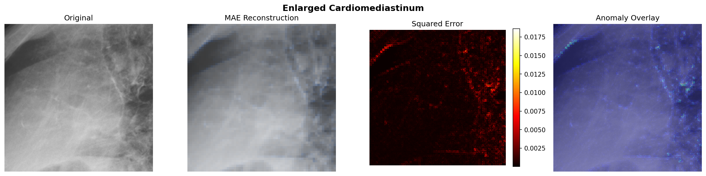

---

### 6. Fracture
Bone fractures visible in the chest X-ray (ribs, clavicle, etc.).

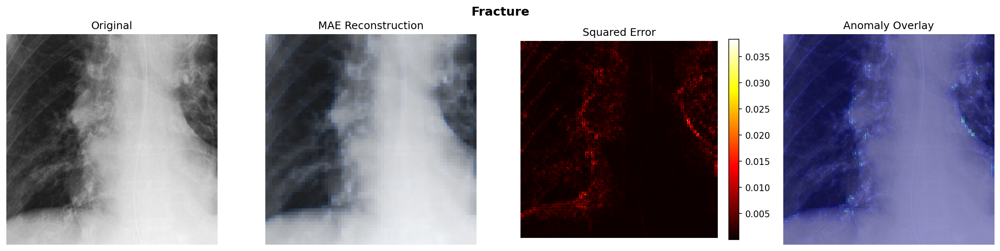

---

### 7. Lung Lesion
Abnormal tissue growth or mass in the lung.

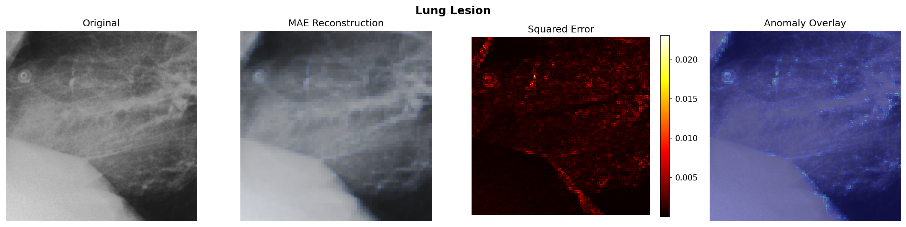

---

### 8. Lung Opacity
General term for any area of increased density in the lung.

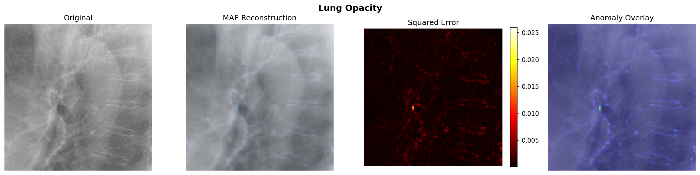

---

### 9. Pleural Effusion
Fluid accumulation in the pleural space surrounding the lungs.

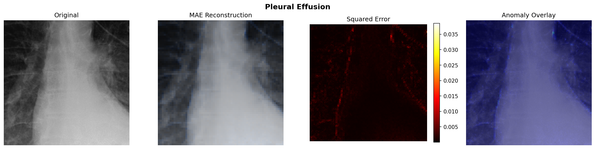

---

### 10. Pleural Other
Other pleural abnormalities (thickening, calcification, etc.).

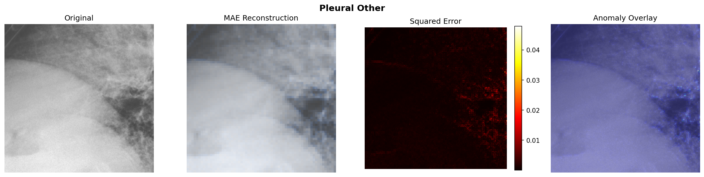

---

### 11. Pneumonia
Infection causing inflammation and consolidation in lung tissue.

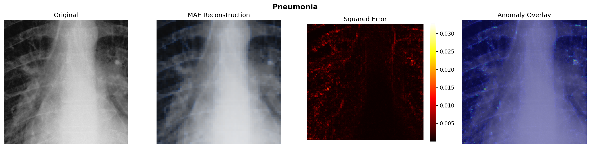

---

### 12. Pneumothorax
Air in the pleural space causing lung collapse.

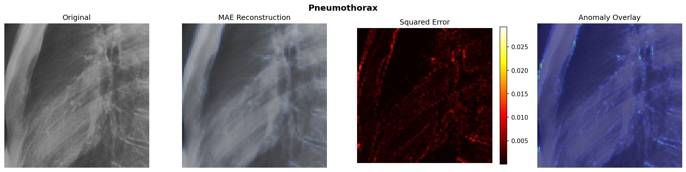

---

### 13. Support Devices
Medical devices visible in the image (tubes, lines, pacemakers, etc.).

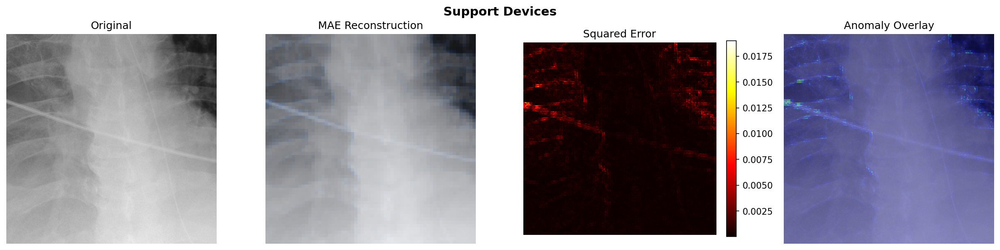

---

## Technical Details

- **Model**: ViT-Base MAE (embed_dim=768, 12 encoder layers)
- **Image Size**: 1024x1024 pixels (center crop from original ~3000x2500)
- **Patch Size**: 16x16 pixels (4096 patches total)
- **Mask Ratio**: 75% (3072 patches masked, 1024 visible)
- **Training Data**: Normal chest X-rays only (No Finding = 1.0)
- **Validation Set**: Anomalous validation cohort (4,922 images)

## Implications for Anomaly Detection

The reconstruction error patterns suggest:

1. **Pneumothorax detection** may be particularly effective using MAE reconstruction, as the absence of lung markings in affected regions produces high error.

2. **Fractures** create sharp discontinuities that the model cannot predict, leading to localized high error.

3. **Diffuse conditions** (Edema, Pneumonia) show more distributed error patterns across lung fields.

4. **Cardiomegaly** shows moderate error concentrated around the cardiac border, suggesting the model has learned some heart size variation but not extreme enlargement.

5. **Support Devices** show relatively low error, possibly because their linear patterns are partially predictable, though the error is concentrated along device edges.

---

*Generated: January 2026*
*Model: mae_final.pt (trained on MIMIC-CXR normal cohort)*
